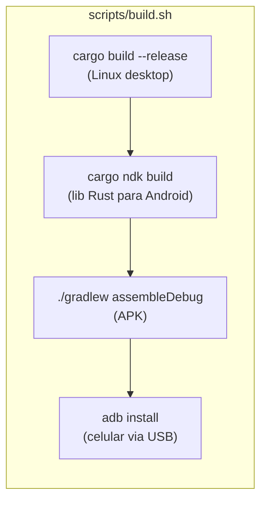

# ADR-003: Script de Build Unificado (Linux + Android)

**Data:** 2026-07-07
**Status:** Aceito

> Este ADR também cobre as otimizações de build aplicadas junto com o
> script — linker mold e cache sccache.

## Contexto

O projeto tem dois targets de build: Linux desktop (binário nativo) e
Android (APK via cargo-ndk + Gradle). Antes o desenvolvedor precisava
executar comandos manuais em sequência. Precisamos de um comando único
que faça tudo e instale no celular.

Além disso, o primeiro build com Bevy leva de 15 a 30 minutos. Para
acelerar o ciclo de desenvolvimento, adicionamos otimizações de build.

## Decisão

### Script de build

Criar `scripts/build.sh` que executa os três passos em sequência:



### Otimizações de build

**Linker mold** — troca o linker padrão (`ld`) pelo `mold`, que é 5-10x
mais rápido em linking. Configurado em `.cargo/config.toml`:
```
[target.x86_64-unknown-linux-gnu]
linker = "clang"
rustflags = ["-C", "link-arg=-fuse-ld=mold"]
```

**sccache** — cache de compilação distribuído. Evita recompilar
dependências (Bevy, wgpu, etc.) que não mudaram entre builds.
Configurado globalmente:
```
[build]
rustc-wrapper = "sccache"
```

**Perfil release** (já existente em `Cargo.toml`):
- `lto = "thin"` — otimização de link-time
- `codegen-units = 1` — máxima otimização
- `strip = true` — remove símbolos de debug
- `panic = "abort"` — elimina tabelas de unwinding

## Comandos Manuais (caso queira passos separados)

```bash
# Linux desktop
cargo build --release --package tabletop

# Android (lib Rust)
cargo ndk -t arm64-v8a -o app/android/app/src/main/jniLibs build --release

# Android (APK)
cd app/android && ./gradlew assembleDebug

# Instalar no celular
adb install -r app/android/app/build/outputs/apk/debug/app-debug.apk
```

## Impacto

- **Pré-requisito:** `cargo install cargo-ndk` (já instalado no container)
- **Dependências:** `mold`, `clang`, `sccache` adicionados ao Dockerfile
- **ADB:** opcional — se não detectar dispositivo, o script só não instala
- **Builds seguintes:** muito mais rápidos graças ao sccache + mold
