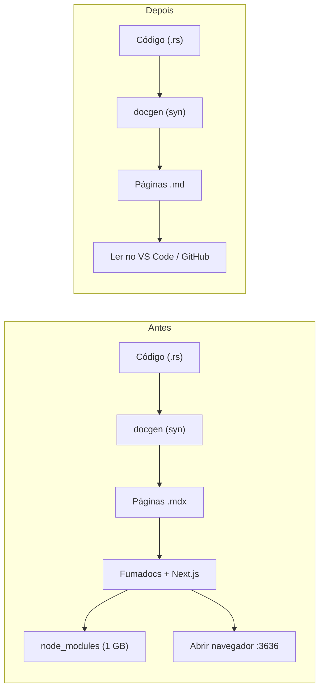
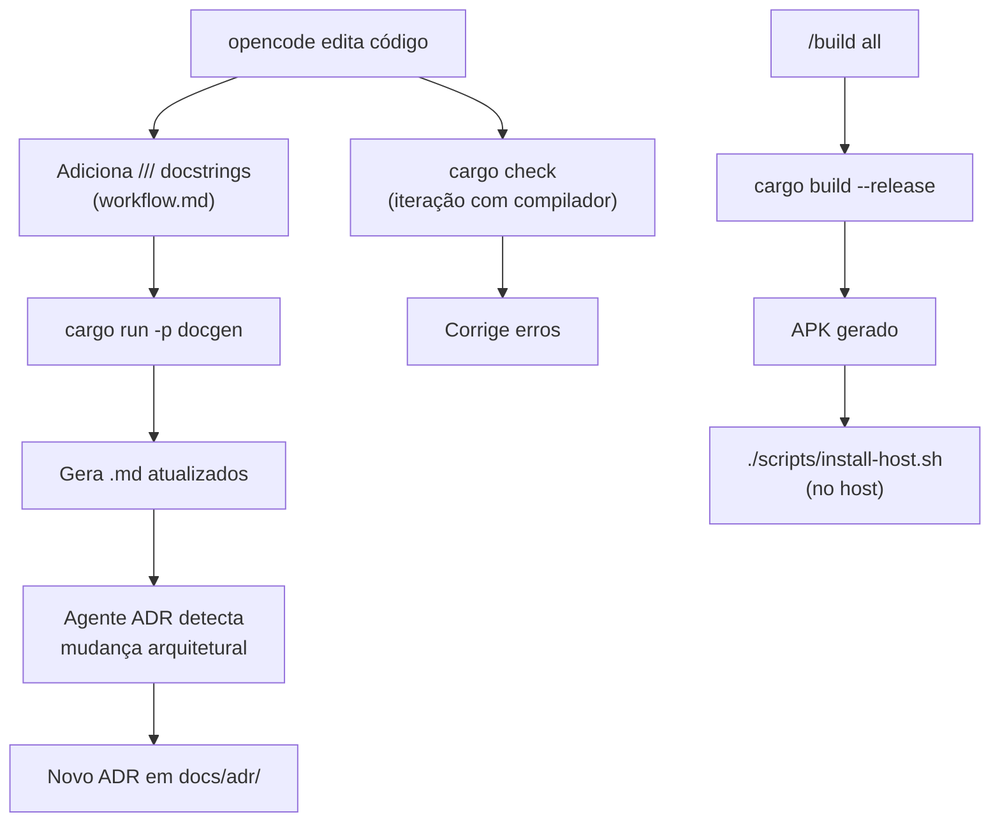

# ADR-004: Documentação e Workflow de Desenvolvimento com opencode

**Data:** 2026-07-09
**Status:** Aceito

## Contexto

O projeto cresceu e o desenvolvedor usa o opencode (CLI de IA) como
ferramenta principal de codificação. Para manter a qualidade, precisamos
de:

1. **Documentação viva** — que reflita o código real, não um site separado
2. **Workflow explícito** — regras que o opencode siga em toda interação
3. **Código Rust idiomático** — sem atalhos, com tratamento de erro correto
4. **Ciclo rápido** — builds otimizados com sccache e mold

## Decisões

### 1. Documentação em Markdown Puro (fim do Fumadocs/Next.js)

A docstring vivia no Next.js (Fumadocs) que ocupava ~1 GB com
node_modules e build tooling, e não era usada ativamente.

**Mudança:** substituímos o site de documentação Next.js por arquivos
`.md` puros gerados pelo docgen, lidos diretamente no VS Code ou GitHub.



### 2. workflow.md — Instruções injetadas pelo opencode

Criamos `.opencode/workflow.md`, incluído via `opencode.json`:

```json
"instructions": ["AGENTS.md", ".opencode/workflow.md"]
```

As regras aplicadas em toda conversa:

| Regra | Descrição |
|---|---|
| **Docstrings** | `///` em toda função, struct, enum e módulo público |
| **Idiomatic Rust** | Ownership, borrowing e lifetime explícitos |
| **Sem `unwrap()`** | Tratar erros com `?` ou fallback |
| **Clone mínimo** | Preferir `&T` a `clone()` |
| **Concorrência** | Justificar `Arc`/`Mutex`/`Rc` |
| **Iteração** | Rodar `cargo check` após alterações |

### 3. sccache ativado globalmente

O sccache estava instalado mas `RUSTC_WRAPPER` não estava configurado.
Adicionamos ao `.cargo/config.toml` do container e ao Dockerfile:

```toml
[target."cfg(all())"]
rustc-wrapper = "sccache"
```

Isso torna `cargo clean` seguro — dependências voltam do cache em
segundos.

### 4. Build sem ADB no container

O script `scripts/build.sh` não tenta mais `adb install` (container não
tem acesso USB). Um script separado `scripts/install-host.sh` roda no
host e instala o APK via ADB.

### 5. docgen gera .md (não .mdx)

O gerador de documentação foi modificado para:

- Extensão `.md` em vez de `.mdx`
- Sem frontmatter (`---`)
- Sem `_meta.json` (navegação Fumadocs)
- Sem componentes JSX/React

## Fluxo de trabalho



## Consequências

### Positivas
- Redução de ~20 GB em disco (`target/` limpo + `docs/` sem node_modules)
- Documentação sempre atualizada (docstring → docgen → .md)
- opencode já "nasce sabendo" as regras de estilo
- Builds mais rápidos (sccache finalmente ativo)

### Negativas
- Perdeu-se o site navegável com busca (Fumadocs)
- docgen precisa ser executado manualmente após mudanças
- ADR-004 substitui a necessidade dos ADRs 001 e 002 (perdidos na migração)

## Referências

- ADR-003: Script de Build Unificado
- `.opencode/workflow.md` — regras de estilo
- `opencode.json` — configuração do opencode
- `scripts/install-host.sh` — instalação no celular pelo host
- `scripts/build.sh` — build completo (sem ADB)
- `docgen/src/generate.rs` — geração de .md
