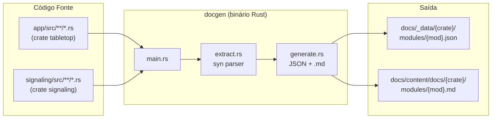

# ADR-005: Documentação Automatizada via docgen

**Data:** 2026-07-09
**Status:** Aceito

## Contexto

O projeto precisa de documentação que reflita fielmente o código sem
esforço manual duplicado. Antes tínhamos um site Fumadocs/Next.js que
exigia escrever páginas .mdx separadas, rapidamente desatualizadas.

Criamos o `docgen`, um binário Rust que lê o código-fonte das crates
`tabletop` e `signaling`, extrai docstrings via `syn` (parser sintático
do Rust) e gera tanto JSON estruturado quanto Markdown renderizável.

## Decisão

### Arquitetura geral



### 1. Extração (`extract.rs`)

Usa `syn` para fazer parsing completo da AST de cada arquivo `.rs`.
Para cada módulo, extrai:

| Categoria | O que captura | Fonte na AST |
|---|---|---|
| **Module doc** | `//! ...` | `syntax.attrs` (nível arquivo) |
| **Structs** | nome, campos (nome+tipo), derives, atributos, docstring (`///`) | `Item::Struct` |
| **Enums** | nome, variantes (nome, campos, doc), derives, generics | `Item::Enum` |
| **Funções** | nome, parâmetros, retorno, async, visibilidade, docstring | `Item::Fn` |
| **Traits** | nome, métodos, docstring | `Item::Trait` |
| **Impl blocks** | self_ty, trait_name (se trait impl), métodos | `Item::Impl` |
| **Consts** | nome, tipo, valor, docstring | `Item::Const` |
| **Type aliases** | nome, tipo, docstring | `Item::Type` |
| **Uses** | string do `use` | `Item::Use` |
| **Submódulos** | nome (`mod foo;` com conteúdo inline) | `Item::Mod` |

A extração percorre a árvore de diretórios com `walkdir`, processando
todo `.rs` abaixo de `src/`.

**Detecção Bevy:** após extrair structs, o docgen identifica
automaticamente Resources, Components e Events pela presença de derives
(`#[derive(Resource)]`, etc.) ou atributos específicos. Funções com
parâmetros como `Res<...>`, `Query<...>`, `Commands` são marcadas como
systems.

**Bug corrigido (ADR-005):** a função `format_doc_attr` original só
tratava `#[doc = "..."]` como `Meta::List`, mas o syn representa
atributos de docstring como `Meta::NameValue`. A correção adicionou
tratamento para ambos os casos. Também foi corrigido o uso de
`quote!(#c.ty)` que, por ambiguidade de parsing do `quote!`, interpolava
o item `c` inteiro seguido dos tokens `. ty` — a solução foi ligar cada
campo em uma variável local (`let ty = &c.ty; quote!(#ty)`).

### 2. Geração de JSON (`generate.rs`)

Para cada crate (`tabletop`, `signaling`):

```
docs/_data/
  tabletop/
    index.json          → sumário de módulos
    modules/
      protocol.json     → dados completos do módulo
      net.json
      game__map.json
      ...
    deps.json           → grafo de dependências (imports + submodulos)
  signaling/
    index.json
    modules/
      ...
  _global.json          → sumário de todas as crates
```

O JSON estruturado serve como **fonte de verdade** para ferramentas
externas (ex: geradores de site, CI, análise).

### 3. Geração de Markdown (`generate.rs`)

```
docs/content/docs/
  tabletop/
    index.md            → overview da crate com graph TD dos módulos
    modules/
      protocol.md       → página completa do módulo
      net.md
      game__map.md
      ...
  signaling/
    index.md
    modules/
      ...
```

Cada página `.md` inclui:
- Docstring do módulo (`//!`)
- Resources, Events, Components (com campos e docstrings)
- Structs, Enums, Funções, Systems, Implementações
- **Constantes** e **Type aliases** (tabelas com nome, tipo, docstring)
- Diagramas Mermaid para módulos-chave (`net`, `sync`, `tokens`)

Os `.md` são puros — sem frontmatter, sem JSX, sem `_meta.json` —
legíveis diretamente no VS Code ou GitHub.

### 4. Integração com opencode

O agente `doc` (`.opencode/agents/doc.md`) orquestra a documentação:
1. Lê o arquivo para entender o contexto
2. Adiciona `//!` module-level se ausente
3. Adiciona `///` em cada item público sem docstring
4. Roda `cargo check` (não quebra código)
5. Roda `cargo run -p docgen` para regenerar `.md`
6. Retorna sumário do que foi documentado

O `.opencode/workflow.md` exige docstrings em toda função, struct, enum
e módulo público criado ou alterado.

## Consequências

### Positivas
- **Documentação sempre atualizada**: docstring → docgen → .md, sem
  duplicação manual
- **Zero infraestrutura**: só Rust + syn, sem node_modules, sem servidor
- **CI-friendly**: pode rodar `cargo run -p docgen` em PR para verificar
  se docstrings foram adicionadas
- **Bate-papo com opencode**: agente `doc` automatiza o ciclo inteiro

### Negativas
- docgen precisa ser executado manualmente (ou via CI) — não há watcher
- Diagramas Mermaid são codados manualmente em `generate.rs`, não saem
  do código fonte
- docgen não entende macros procedural — itens gerados por `#[derive]`
  ou `impl_foo!` não aparecem

## Como usar

```bash
# Gerar documentação (requer build uma vez)
cargo run -p docgen

# Ver resultado em Markdown
cat docs/content/docs/tabletop/modules/protocol.md

# Ver JSON estruturado
cat docs/_data/tabletop/modules/protocol.json | python3 -m json.tool
```

## Referências

- `docgen/src/main.rs` — entrypoint, configura as duas crates
- `docgen/src/extract.rs` — parser syn, extração de todos os itens
- `docgen/src/generate.rs` — geração JSON + Markdown + diagramas
- `.opencode/agents/doc.md` — agente opencode para documentar
- `.opencode/workflow.md` — regra de docstrings obrigatórias
- ADR-004: Documentação e Workflow de Desenvolvimento com opencode