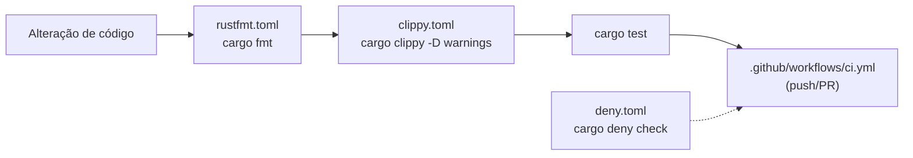

# ADR-006: Type-Driven Design e Portões de Qualidade

**Data:** 2026-07-16
**Status:** Aceito

## Contexto

Recebemos um "plano de qualidade premium" originalmente escrito para outro
projeto — `fiscal-rs`, um sistema de NF-e/SEFAZ. A maior parte daquele plano é
**regra de domínio fiscal** (`TaxId`, `IcmsCst`, `AccessKey`, certificados A1/A3,
comunicação SEFAZ) e **não se aplica** ao tabletop-p2p.

O que transfere são os **princípios de engenharia** por trás do plano. Este ADR
os extrai, contextualiza para o VTT (rede P2P, GM autoritativo, protocolo
`bincode`) e os transforma em regras acionáveis — evitando colar domínio que
não existe aqui.

## O que transfere vs. o que não transfere

| Princípio (transfere) | Domínio fiscal (descartado) |
|---|---|
| Parse, don't validate / newtypes | `TaxId`, `Cnpj`, `Ncm`, `Cfop`, `Cents`, `Rate` |
| Estados inválidos inexprimíveis (enums) | `IcmsCst`, `ContingencyMode` |
| Typestate para ciclo de vida | `Invoice<Draft→Signed→Authorized>` |
| `thiserror` + `#[non_exhaustive]` + sealed | `SefazRejection`, `CertificateError` |
| `rustfmt`/`clippy`/`deny` + CI | crates `fiscal-crypto`, `fiscal-sefaz` |
| proptest / insta / criterion | fuzzing de XML SEFAZ, DANFE |

## Decisão

Adotamos 6 princípios (detalhados no `AGENTS.md`, seção *Padrões de Código*) e
uma camada de portões de qualidade que os força.

### 1. Parse, don't validate

Newtypes no lugar de `type` aliases crus. Hoje `protocol.rs` tem
`type PlayerUuid = u64` e código de sala como `String` livre — qualquer `u64`
ou string passa. O alvo é validar no construtor e confiar no tipo depois:

```rust
// antes
pub type PlayerUuid = u64;      // aceita qualquer u64
// alvo
pub struct RoomCode(String);    // valida CODE_ALPHABET + tamanho em ::parse
pub struct ColorIdx(u8);        // 0..8, índice sempre válido na PALETTE
```

Isso elimina remendos reais do código, como o `% PALETTE.len()` em
`palette_color`, que só existe porque o índice não é validado na origem.

### 2. Estados inválidos inexprimíveis

Enums algébricos que carregam só os campos válidos de cada caso — padrão já
presente em `Msg` e `GridKind`. Papel (GM/Jogador) e modo de drop (MAPA/TOKEN)
viram tipos, não `bool` + checagem espalhada.

### 3. Typestate para ciclo de vida

O ciclo `Boot → Lobby → InGame` já existe como `AppState` (Bevy States). Ele é o
padrão oficial de ciclo de vida; operações de rede só devem existir no estado
que as permite (o análogo do `Invoice<Signed>` que só então vai à SEFAZ).

### 4. Erros com `thiserror`

O projeto ainda não usa `thiserror`. Introduzimos enums de erro (`NetError`,
`ProtocolError`) e propagação com `?`, reforçando a regra "sem `unwrap()`" já
existente — especialmente no caminho de rede, onde falhas são esperadas.

### 5. `#[non_exhaustive]` no que evolui

`Msg` é um **protocolo de rede versionado**: adicionar variante não pode quebrar
peers/consumidores. `#[non_exhaustive]` nos enums públicos de protocolo e de
erro; structs públicas complexas com construtor/builder.

### 6. Sealed traits

Traits de comportamento interno (serialização de mensagem, layout) são *sealed*:
extensão controlada, só nossos tipos as implementam.

### Portões de qualidade



- `rustfmt.toml` — `edition = 2021` (o projeto **não** usa 2024), `max_width = 100`.
- `clippy.toml` — `msrv` alinhado à toolchain, limite de complexidade cognitiva.
- `deny.toml` — allow-list de licenças + avisos de vulnerabilidade
  (`cargo deny check`, manual/futuro no CI).
- `ci.yml` — `fmt --check` + `clippy -D warnings` + `test` + `doc`.

## Consequências

### Positivas
- Bugs de "valor cru inválido" migram de runtime para tempo de compilação.
- Protocolo evolui sem quebrar peers antigos.
- CI barra formatação/lint/teste antes do merge.

### Negativas
- Refatorar `type` aliases → newtypes toca vários arquivos (feito de forma
  incremental, começando por `protocol.rs`/`net.rs`).
- Build de Bevy no CI é pesado (mitigado por cache de dependências).

## Referências

- ADR-004: Documentação e Workflow de Desenvolvimento (regras de estilo base)
- `AGENTS.md` — seção *Padrões de Código (Type-Driven Design)*
- `rustfmt.toml`, `clippy.toml`, `deny.toml`, `.github/workflows/ci.yml`
- `app/src/protocol.rs` — `Msg`, `GridKind`, `PlayerUuid` (alvos dos newtypes)
