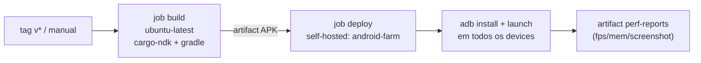

# ADR-007: Deploy de Versões em Celulares Físicos via GitHub Actions

**Data:** 2026-07-19
**Status:** Aceito

## Contexto

Para certificar bom desempenho em aparelhos antigos (ex.: Galaxy J7, moto g06),
precisamos instalar cada nova versão do APK **em celulares físicos reais** e
medir fps/memória. Queríamos disparar isso pelo GitHub Actions — idealmente ao
criar uma tag de versão.

O obstáculo central: **runners hospedados do GitHub (`ubuntu-latest`) vivem na
nuvem** e não têm acesso físico (USB/adb) aos celulares na nossa mesa. Um job na
nuvem nunca conseguiria fazer `adb install` num aparelho local.

## Decisão

Pipeline de **dois jobs** (`.github/workflows/deploy-devices.yml`):

1. **`build`** — roda na nuvem (`ubuntu-latest`). Instala toolchain Rust +
   NDK `28.2.13676358` + `cargo-ndk`, compila a lib nativa (`arm64-v8a`), monta
   o APK com Gradle e publica como *artifact*. Não depende da nossa máquina.

2. **`deploy`** — roda num **self-hosted runner** (label `android-farm`)
   instalado na máquina que tem os celulares conectados via `adb` (USB ou WiFi).
   Baixa o artifact e executa `scripts/deploy-farm.sh`.

O self-hosted runner é a **ponte** entre o GitHub e o `adb` local — é o que torna
o "lançar direto nos aparelhos" possível.

### Fan-out para vários aparelhos

`scripts/deploy-farm.sh` itera sobre **todos** os devices em estado `device`
(`adb devices`), não só o primeiro. Para cada um: instala (com reinstalação
automática em caso de assinatura incompatível), inicia pelo **LAUNCHER**
(robusto para `NativeActivity`), aguarda alguns segundos e coleta um relatório
por aparelho (modelo, versão do Android, `gfxinfo`, `meminfo`, log e screenshot),
publicados como artifact `perf-reports`.

### Gatilhos

- `push` de tag `v*` → lançar uma versão.
- `workflow_dispatch` → botão manual, com input `launch_seconds`.

## Alternativas consideradas

- **Build também no self-hosted** — reutilizaria o `Sdk/` e caches locais, mas
  prende a nossa máquina e exige toolchain completo no host. Optamos por build na
  nuvem (portável) e host só com `adb`.
- **Firebase Test Lab / device farm na nuvem** — ótimo para aparelhos que **não
  possuímos**, via *Game Loop test*. Fica como complemento futuro, não substitui
  o teste nos nossos próprios celulares antigos.

## Consequências

### Positivas
- Um `git push` de tag instala a versão em todos os celulares plugados e devolve
  métricas de desempenho por aparelho.
- Build na nuvem não ocupa a máquina de desenvolvimento.

### Negativas / riscos conhecidos
- Exige um self-hosted runner sempre no ar (recomendado como serviço systemd).
- **minSdk 24**: aparelhos em Android < 7.0 não instalam o APK (o script pula e
  marca falha). Rebaixar `minSdk` se necessário.
- **Vulkan × GLES**: o wgpu tenta Vulkan primeiro; GPUs antigas (ex.: Mali-T830
  do J7) podem não suportar → o app pode abrir e fechar. O fallback GLES é
  trabalho de código à parte (ver `android-port-status.json`, passo 5).

## Referências

- `.github/workflows/deploy-devices.yml` — pipeline build + deploy
- `scripts/deploy-farm.sh` — instalação e medição multi-device
- `docs/content/docs/deploy/index.md` — runbook operacional
- ADR-003 — Script de Build Unificado (Linux + Android)
