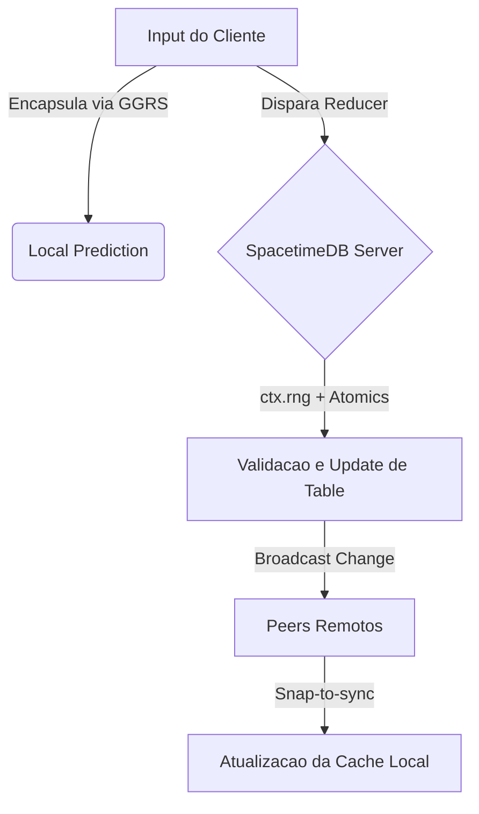

# Especificação Técnica Mestre — Projeto MVCAP2P

**Status:** Fonte Única da Verdade (SSOT)
**Escopo:** Plataforma de simulação distribuída P2P de alta fidelidade em Rust.

> Este documento constitui a **Fonte Única da Verdade (SSOT)**. Nenhuma implementação
> será aceita no repositório se divergir das definições aqui estabelecidas. A
> organização do **GitHub Projects** deve refletir exatamente os marcos e critérios
> de aceite deste plano.

---

## 1. Visão Geral e Diretrizes Estratégicas

O projeto MVCAP2P é uma plataforma de simulação distribuída P2P de alta fidelidade
técnica, fundamentada em Rust. Esta arquitetura impõe um modelo de sincronização
híbrido, utilizando **GGRS** para gerenciamento de rollback de entrada e
**SpacetimeDB** para persistência de estado autoritativo e gerenciamento de identidade.

### Pilares de Design

| Pilar | Prioridade Técnica | Contraste | Rationale |
| --- | --- | --- | --- |
| Sincronização | Determinismo Absoluto | Simulação Estocástica | Garantir que o estado da física seja idêntico em x86 e ARM sem drifts de rede. |
| Identidade | Persistência Baseada em Token | Login Tradicional (e-mail/senha) | Reduzir fricção de UX no Alpha e herdar segurança criptográfica do SpacetimeDB. |
| Performance | Otimização para ARM/V7 | Compatibilidade Universal | O "piso" de hardware é o Raspberry Pi 3; o software deve rodar a 30 FPS estáveis neste alvo. |
| Arquitetura | Transações Atômicas (Reducers) | Mutação de Estado Direta | Prevenir corrupção de estado via race conditions em ambientes distribuídos. |

---

## 2. Stack Tecnológico e Infraestrutura de Linguagem

A padronização de ambiente é mandatória. Divergências de versão resultam em rejeição
automática no CI/CD.

- **Linguagem:** Rust 1.97.1 (Estável).
- **Engine:** Bevy 0.18 (rede P2P via `bevy_matchbox` 0.14 — teto de compatibilidade atual).
- **Gestão de Workspace:** Obrigatório o uso de Rust Workspaces para segregar lógica
  de servidor (WASM/SpacetimeDB) e cliente (Bevy).
- **Otimização de Compilação (sccache):** O uso de `sccache` é obrigatório para todos
  os desenvolvedores e agentes de CI.
  - **Configuração Local:** adicionar o wrapper ao `.cargo/config.toml`.
  - **Variáveis de Ambiente:** configurar `SCCACHE_BASEDIRS` para normalizar caminhos
    absolutos e garantir cache hits entre diferentes diretórios de build. Utilizar
    `SCCACHE_IGNORE_SERVER_IO_ERROR=1` para evitar falhas de compilação por
    instabilidade do wrapper.

---

## 3. Arquitetura de Rede P2P e Sincronização

A arquitetura utiliza um modelo híbrido para resolver o trilema de rede:
Consistência, Persistência e Baixa Latência.

### Identidade e Persistência (SpacetimeDB)

- **Gerenciamento de Identidade:** cada peer é identificado por uma `Identity` de
  256-bit exclusiva, derivada de um arquivo de token persistido localmente. O sistema
  deve mapear esta `Identity` como chave primária em todas as tabelas.
- **Reducers e Determinismo:** toda mutação de estado no servidor deve ocorrer via
  **Reducers**. É estritamente proibido o uso da crate `rand` padrão dentro do módulo
  `server`. Deve-se utilizar obrigatoriamente `ctx.rng()` para garantir geração de
  números aleatórios determinística e auditável pelo motor do banco de dados.

### Sincronização de Gameplay (GGRS/WebRTC)

- **Input Rollback:** GGRS gerencia os frames de entrada via WebRTC para esconder a
  latência de rede.
- **State Sync:** o SpacetimeDB atua como "Game Master Autoritativo", injetando o
  estado inicial via protocolo `Welcome` e persistindo mudanças globais através de
  tabelas públicas.

### Diagrama de Fluxo Lógico

---

## 4. Física e Determinismo Crítico (Rapier)

A física deve ser idêntica bit-a-bit entre o simulador x86 e os dispositivos ARM.

- **Configuração Obrigatória (`Cargo.toml`).**
- **Feature `enhanced-determinism`:** ativa o rigor do padrão IEEE 754-2008. SIMD deve
  ser mantido desativado se causar divergência.
- **Snapshotting:** a feature `serde-serialize` deve ser usada para criar snapshots do
  estado físico para validação de checksum entre peers.

### Matriz de Tratamento de Desync

| Causa Provável | Método de Detecção | Ação Corretiva |
| --- | --- | --- |
| Float Drift (ARM vs x86) | Checksum mismatch no frame N. | **Hard Fallback:** migrar aritmética para Ponto Fixo se desync > 3 eventos/60s. |
| Perda de Ordem de Input | `GGRS SyncTestSession` falha. | Forçar `SystemOrder` explícito no escalonador do Bevy. |
| Latência Excessiva | RTT > 250ms detectado no Inspector. | Ativar Interpolação Agressiva; se persistir, desconectar peer. |

---

## 5. Interface 2.0 e Ergonomia do Usuário

A UI deve ser tratada como cidadã de primeira classe no ECS, permitindo snapshots de
interface.

- **Arquitetura Assíncrona:** o processamento de UI não pode bloquear a thread de
  física/sincronização.
- **Hierarquia de Entidades:** proibido o uso exclusivo de "Immediate Mode UI".
  Elementos devem ser entidades Bevy com transformadas locais para permitir escala
  dinâmica em dispositivos móveis.
- **Foco Dual Stick:**
  - Controles virtuais devem ter zonas mortas configuráveis.
  - **Floating Menu:** deve ser instanciado como uma sub-árvore de entidades para
    garantir persistência de estado visual durante rollbacks.

---

## 6. Marco Alpha: Sistemas de Gameplay

Estética visual guiada pelo minimalismo industrial ("Fallout 1 Tutorial").

- **Visual:** paleta industrial de alto contraste; materiais PBR com valores fixos de
  `metallic: 0.8` e `roughness: 0.4` para props metálicos.
- **Assets:** máximo de 2k triângulos por modelo `.glb`. Suporte obrigatório para
  injeção dinâmica de ícones PNG para o sistema de macros.
- **Habilidades:** macros acionam Reducers que validam a transação no servidor antes
  de disparar animações glTF sincronizadas localmente.

---

## 7. Protocolo de QA e Testes de Integração

**Gate de Commit:** nenhum PR será aprovado sem o log de performance do Raspberry Pi 3.

- **Hardware Proxy:** o Raspberry Pi 3 deve ser configurado como ambiente de execução
  headless para validar o consumo de recursos.
- **Métricas de Readiness (KPIs):**
  - **FPS:** > 30 FPS estáveis em cena de estresse (10 jogadores).
  - **Memória:** consumo de RAM < 512MB (contagem total da aplicação).
  - **Rede:** latência de processamento de Reducer < 50ms.

---

## 8. Backlog de Épicos (GitHub Projects)

Cada card no GitHub Projects deve seguir rigorosamente os critérios abaixo.

### 1. [Infra] Configuração de Workspace e Cache
- **Ação:** implementar estrutura de membros `server`/`client` e habilitar `sccache`
  via `.cargo/config.toml`.
- **Critério de Aceite:** `cargo build --workspace` deve compilar ambos os membros
  simultaneamente. `sccache --show-stats` deve confirmar cache hits após a segunda
  compilação limpa.

### 2. [Rede] Core de Identidade SpacetimeDB
- **Ação:** criar tabela `Player` com chave primária `Identity` e implementar lógica
  de token persistente.
- **Critério de Aceite:** o cliente deve reconhecer o mesmo `username` gerado
  randomicamente após o reinício da aplicação, validado via query SQL no servidor.

### 3. [Física] Setup Rapier Determinístico
- **Ação:** configurar features de determinismo e implementar sistema de validação de
  checksum de estado.
- **Critério de Aceite:** simulação de 1000 frames sem desync entre uma instância em
  Linux x86 e outra em ARM (validado por `SyncTestSession`).

### 4. [UI] Framework de Interface ECS
- **Ação:** implementar Top Inspector assíncrono exibindo FPS e RTT.
- **Critério de Aceite:** a UI deve manter 60 FPS estáveis mesmo quando a thread de
  simulação física sofrer queda de performance (testado via carga artificial).

> **Mandato de Gerência:** "Configure o workflow de automação do GitHub: cards movem
> para 'QA' apenas com anexo do log do Raspberry Pi 3. Falha em atingir os KPIs de
> performance resulta em retorno automático para 'In Progress'."
