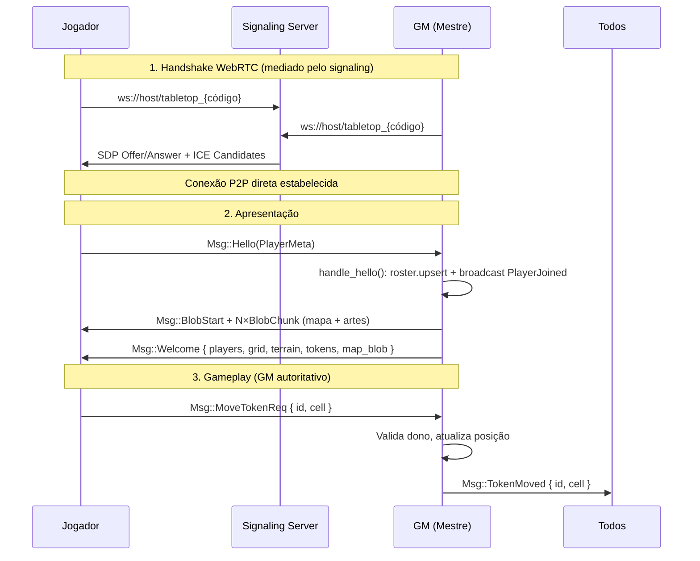

# Especificação Técnica Mestre — Projeto MVCAP2P

**Status:** Fonte Única da Verdade (SSOT)
**Escopo:** VTT tático 3D low-poly peer-to-peer em Rust/Bevy.

> Este documento constitui a **Fonte Única da Verdade (SSOT)**. Nenhuma implementação
> será aceita no repositório se divergir das definições aqui estabelecidas. A
> organização do **GitHub Projects** deve refletir exatamente os marcos e critérios
> de aceite deste plano.
>
> **Nota:** Esta SSOT foi revisada em 2026-07-21 conforme ADR-011 (simplificação
> do roadmap). O stack SpacetimeDB/GGRS/Rapier previsto anteriormente foi removido.

---

## 1. Visão Geral e Diretrizes Estratégicas

O projeto MVCAP2P é um VTT (Virtual Tabletop) tático **3D low-poly peer-to-peer**
em Rust/Bevy. Não há servidor de jogo: o **Mestre (GM) é o host autoritativo**.
Toda a comunicação entre peers é via WebRTC DataChannel (confiável/ordenado),
mediado por um servidor de sinalização WebSocket (matchbox).

### Pilares de Design

| Pilar | Prioridade Técnica | Contraste | Rationale |
| --- | --- | --- | --- |
| Sincronização | GM Autoritativo | Consenso Distribuído | GM valida e broadcast de toda mutação; sem rollback, sem conflito. |
| Identidade | Token Persistente Local | Login (e-mail/senha) | Identidade de 256-bit gerada localmente, persistida em arquivo. Zero dependência de servidor. |
| Performance | Otimização para ARM | Compatibilidade Universal | O "piso" de hardware é o Raspberry Pi 3; o software deve rodar a 30 FPS estáveis neste alvo. |
| Arquitetura | P2P puro (sem servidor de jogo) | Cliente-Servidor | Cada peer conecta-se diretamente aos outros via WebRTC. O signaling troca só handshakes. |

### Papéis: GM e Jogador

O projeto define dois papéis distintos baseados em **quem cria a sala**:

| Aspecto | GM (Game Master) | Jogador |
|---|---|---|
| **Como se torna** | Cria uma sala (`--gm` / botão "Abrir Sala") | Conecta-se a uma sala existente (código) |
| **Autoridade** | Autoritativo — valida toda mutação e faz broadcast do estado final | Requisitante — envia `*Req` e aguarda aprovação do GM |
| **Conteúdo** | Carrega e gerencia: mapas, tokens, animações, cutscenes, efeitos, cenários | Interage com os recursos disponibilizados pelo GM via broadcast |
| **Controle de tokens** | Move qualquer token da cena | Move apenas os tokens atribuídos a si |
| **Persistência** | Salva o estado da sala (último mapa, posições, assets carregados) | Recebe o estado completo via `Welcome` ao conectar |
| **Rede** | Host do DataChannel — processa `*Req`, valida, broadcast | Peer — envia requests, recebe broadcasts |

**Qualquer usuário pode ser GM** — basta criar uma sala. O mesmo usuário pode ser GM
em uma sala e jogador em outra. O papel é por sala, não por conta.

O GM não é um "admin" no sentido de permissões especiais no software: é simplesmente
o peer que hospeda a partida e, portanto, é a autoridade sobre o estado do jogo
naquela sala. Essa arquitetura elimina a necessidade de um servidor de jogo dedicado.

---

## 2. Stack Tecnológico e Infraestrutura de Linguagem

A padronização de ambiente é mandatória. Divergências de versão resultam em rejeição
automática no CI/CD.

- **Linguagem:** Rust 1.97.1 (Estável).
- **Engine:** Bevy 0.18 + `bevy_matchbox` 0.14 (WebRTC).
- **Gestão de Workspace:** Rust Workspaces com `shared/` (domínio sem Bevy) e
  `app/` (cliente Bevy).
- **Serialização:** `bincode` + `serde` para mensagens da rede (`Msg` enum).
- **Imagens:** `image` crate (decodificação PNG/JPEG/WebP) + `resvg` (SVG→textura).
- **Otimização de Compilação (sccache):** O uso de `sccache` é obrigatório para todos
  os desenvolvedores e agentes de CI.
  - **Configuração Local:** adicionar o wrapper ao `.cargo/config.toml`.
  - **Variáveis de Ambiente:** configurar `SCCACHE_BASEDIRS` para normalizar caminhos
    absolutos e garantir cache hits entre diferentes diretórios de build. Utilizar
    `SCCACHE_IGNORE_SERVER_IO_ERROR=1` para evitar falhas de compilação por
    instabilidade do wrapper.

---

## 3. Arquitetura de Rede P2P e Sincronização

O modelo é **GM autoritativo** sobre WebRTC DataChannel (canal 0, confiável/ordenado).
Não há rollback, nem GGRS, nem servidor de jogo — o GM é a autoridade final.

### Componentes de Rede

| Camada | Tecnologia | Função |
|--------|-----------|--------|
| **Signaling** | `matchbox_signaling` (WebSocket) | Media handshake WebRTC entre peers. Nenhum dado de jogo passa por ele. |
| **Transporte** | WebRTC DataChannel (confiável) | Canal 0, bincode serializado. Conexão direta P2P após handshake. |
| **Identidade** | Token local de 256-bit | Persistido em `~/.local/share/tabletop/identity.json`. Substitui `rand::random()` por sessão. |
| **Autoridade** | GM (Mestre) | Toda mutação de estado passa pelo GM: clientes enviam `*Req`, GM valida e faz broadcast da versão final. |

### Fluxo de Conexão e Sincronização



### Tratamento de Queda e Reconexão

- Signaling cai → retry com backoff (até 5 tentativas, 1.5s entre cada).
- GM cai → jogadores detectam `PeerState::Disconnected`; aguardam reconexão.
- GM volta → re-Hello do jogador → GM reenvia Welcome completo (resync total).
- Reconexão usa o mesmo código de sala; o estado inteiro cabe num Welcome.
- Identidade do jogador (`Identity` persistente) não muda entre reconexões,
  diferentemente do `PeerId` do WebRTC que é efêmero.

---

## 4. Grid, Terreno e Posicionamento

O tabuleiro é baseado em grade, sem motor de física 3D (Rapier foi removido conforme ADR-011).
O posicionamento usa snap-to-grid sobre coordenadas inteiras.

### 4.1 Grid — Definição

O grid é a **estrutura espacial fundamental** da sala de jogo. Ele mapeia toda a
superfície jogável — o plano — que é o conjunto de plataformas (células) que podem
variar em altitude. Tokens ficam sobre esse plano, posicionados por snap-to-grid.

O grid permeia automaticamente as superfícies: quando o GM cria ou modifica
plataformas com altitudes diferentes, o grid se adapta, mantendo a malha contínua
e calculando distâncias que levam a elevação em conta.

- **Quadrangular** e **Hexagonal flat-top** (coordenadas axiais), alternável pelo GM.
- Tamanho de célula ajustável. Snap-to-grid em ambos os formatos.
- A posição de tokens e terreno é sempre `Cell = (i32, i32)` + elevação `i8`.

### 4.2 Régua (Ruler) — Componente Reutilizável do Grid

A régua é um **componente do grid** que realiza cálculos espaciais. Ela é reutilizável
por qualquer sistema que precise medir distâncias, áreas ou visibilidade no tabuleiro.

#### Formas de Medição

| Forma | Descrição | Uso típico |
|---|---|---|
| **Raio/Esfera** | Círculo centrado em ponto, highlight de todas as células dentro do raio | Área de efeito (bola de fogo, explosão) |
| **Cone** | Ângulo configurável a partir de um token | Sopro de dragão, cone de frio |
| **Linha** | Segmento entre dois pontos, mostra distância em células | Medição de alcance, raio |

Todas as formas respeitam o formato do grid (hex/quad) e a elevação do terreno.

#### Funções de Detecção

A régua fornece queries espaciais que outros sistemas consomem:

- **Contenção (inside)**: se um token/ponto está dentro de uma área
- **Entrada/Saída (enter/exit)**: detecta quando algo entra ou sai de uma área (triggers de zona)
- **Movimento (moved)**: detecta movimentação dentro de uma área monitorada
- **Line of Sight (LoS)**: verifica se um token tem visão direta para outro ponto,
  considerando elevação e obstáculos — base para mecânicas de **cobertura** (cover)

#### Cálculo de Distância com Elevação

A distância entre duas células considera a diferença de altitude:
- **Distância planar**: contagem de células no grid (Manhattan/hex distance)
- **Distância 3D**: raiz da soma dos quadrados (planar² + Δelevação²), para alcance real
- A régua expõe ambas — o sistema que consome decide qual usar

### 4.3 Pathfinding e IA (fundação)

O grid serve de **base para algoritmos de IA** de NPCs/inimigos controlados pelo GM.
A malha do grid é o grafo de navegação — cada célula é um nó, adjacências são arestas.

| Capacidade | Descrição |
|---|---|
| **Pathfinding (A\*)** | Caminho mais curto entre duas células, respeitando elevação e obstáculos |
| **Custo de terreno** | Células podem ter custos diferentes (água = 2x, lava = intransponível) |
| **Busca de cobertura** | IA identifica células que bloqueiam LoS em relação a um alvo |
| **Interatividades do mapa** | IA reconhece portas, alavancas, terreno destrutível como nós especiais do grafo |

> **Nota:** A implementação de IA é de milestone futuro. A fundação do grid (grafo de
> células + custos + LoS) deve ser projetada desde agora para suportar esses algoritmos
> sem refatoração pesada.

### 4.4 Terreno e Mapa — Mundo Dinâmico

O **mapa** e o **grid** são camadas distintas que coexistem:

| Conceito | O que é | Quando importa |
|---|---|---|
| **Mapa** | O mundo contínuo — superfícies, estruturas, cenário 3D. Exploração livre com joystick. | Fora de combate / modo de edição |
| **Grid** | Malha discreta de células sobre o mapa. Snap-to-grid, régua, LoS, pathfinding. | Em combate / modo de edição |

O jogador **explora livremente** o mapa com o joystick (sem restrição de grid).
Em combate ou modo de edição, o grid se sobrepõe ao mapa e todas as interações
passam por snap-to-grid.

#### Mundo Dinâmico (Sala Única)

O jogo opera numa **sala única** — não há telas de loading entre ambientes.
Transições interior/exterior acontecem em tempo real no mesmo espaço:

- O GM constrói o cenário dinamicamente durante a sessão
- Estruturas (paredes, casas, cavernas) são colocadas **snap-to-grid** como blocos
- O jogador pode entrar/sair de estruturas sem transição de cena
- Cenários são salvos e restaurados como parte do estado da sala

#### Estruturas Snap-to-Grid

O GM (e potencialmente jogadores com permissão) pode **colocar blocos** no grid:

- Blocos ocupam células e respeitam a malha do grid (posição + elevação)
- Paredes, portas, escadas, plataformas — cada tipo com propriedades no grafo
  de navegação (bloqueio de LoS, custo de travessia, interatividade)
- Fora do modo de edição, o jogador interage com estruturas (abrir portas,
  subir escadas) via ações contextuais

#### 4.4.1 Sistema de Chunks — Arquitetura de Renderização

> **Estado atual (problema):** cada célula de terreno é uma entidade ECS individual
> (`terrain_render` em `terrain.rs`). Isso gera 1 entity + 1 draw call por célula.
> Com 1000 células = 1000 draw calls — inviável no J7 que suporta ~200-300 draw
> calls a 30 FPS. Não há LOD, culling por distância, batching, nem limite de memória.

O mundo deve ser dividido em **chunks** (agrupamentos espaciais de células)
que são a unidade de renderização, carregamento, descarregamento e sync.

##### Definição de Chunk

```
ChunkCoord = (i32, i32)       // coordenada do chunk no espaço de chunks
CHUNK_SIZE = 8                 // 8×8 células por chunk (64 células)
Cell → ChunkCoord:  chunk = (cell.0 >> 3, cell.1 >> 3)
                    local = (cell.0 & 7, cell.1 & 7)
```

| Propriedade | Valor | Rationale |
|---|---|---|
| **Tamanho** | 8×8 células | Equilibra granularidade de culling vs overhead de chunks. 64 células por mesh é gerenciável para rebuild incremental. |
| **Uma mesh por chunk** | Sim | Todas as células do chunk são combinadas em UMA mesh (merge de vértices). 1 draw call por chunk ativo, não por célula. |
| **Entity por chunk** | 1 | Um `Entity` com `Mesh3d` + `MeshMaterial3d` por chunk visível. |

##### Ciclo de Vida de um Chunk

```
         GM pinta célula
               │
               ▼
     Terrain HashMap atualiza
               │
               ▼
   chunk_coord = cell >> 3
               │
               ▼
   chunk entra na dirty list
               │
               ▼
   rebuild_chunk_mesh()          ← merge das 64 células em 1 mesh
               │
               ▼
   Entity atualizado (ou spawned se novo)
```

##### Rebuild de Mesh por Chunk

Quando um chunk está dirty, o sistema regenera **uma única mesh** combinando
a geometria de todas as células presentes naquele chunk:

- Iterar as ≤64 células do chunk
- Para cada célula: gerar vértices do prisma (cube/hex) na posição local
- Concatenar todos os vértices/índices num único `Mesh`
- Se o chunk ficou vazio (nenhuma célula): despawnar a entity
- **Custo de rebuild:** ~64 prismas × ~24 verts = ~1536 vértices por chunk
  (sub-milissegundo mesmo no J7)

> **Material por chunk:** se todas as células do chunk usam a mesma textura,
> uma única material basta. Se há texturas mistas, usar um texture atlas
> (paleta de terreno como atlas 4×4) e UV mapping para o atlas. Isso mantém
> 1 draw call por chunk independentemente da diversidade de texturas.

##### Draw Distance e Streaming

O mundo é potencialmente infinito. Só os chunks dentro da **draw distance**
existem como entities na ECS:

```
                    ┌─────────────────────┐
                    │  draw_distance      │
                    │  (configurável)     │
                    │    ┌───────────┐    │
                    │    │  câmera   │    │
                    │    │  (foco)   │    │
                    │    └───────────┘    │
                    │  chunks carregados  │
                    └─────────────────────┘
                    chunks fora = despawnados
```

| Anel | Distância (chunks) | Tratamento |
|---|---|---|
| **Próximo** | 0–3 | Mesh completa, material com textura |
| **Médio** | 4–6 | Mesh simplificada (1 quad por chunk, cor média) — LOD 1 |
| **Longe** | 7+ | Não renderizado (despawnado da ECS, dados mantidos na `Terrain` HashMap) |

- A `Terrain` HashMap mantém **todos** os dados (fonte de verdade)
- Chunks entram/saem da ECS conforme a câmera se move
- Transição suave: ao cruzar um anel, o chunk é rebuilt com o LOD adequado
- **Draw distance** é configurável no painel Gráficos (junto com MSAA, sombras, etc.)

##### Implementação — Como Migrar do Sistema Atual

A migração preserva a `Terrain` HashMap como fonte de verdade (sem mudar o
protocolo de rede). Apenas a camada de renderização muda:

1. **Novo recurso `ChunkRender`:**
   ```
   ChunkRender {
       meshes: HashMap<ChunkCoord, Entity>,   // substitui TerrainRender.ents
       dirty: HashSet<ChunkCoord>,             // substitui TerrainRender.dirty (Vec<Cell>)
       active_radius: u32,                     // raio em chunks (draw distance)
   }
   ```

2. **`set_cell()` muda dirty:**
   Em vez de `render.dirty.push(cell)`, faz
   `chunk_render.dirty.insert((cell.0 >> 3, cell.1 >> 3))`.

3. **`terrain_render()` → `chunk_render_system()`:**
   - Calcula chunks visíveis baseado na posição da câmera + `active_radius`
   - Para cada chunk dirty OU recém-entrado no raio: rebuild mesh
   - Para cada chunk que saiu do raio: despawn entity
   - A lógica de `full = true` (Welcome/grid change) marca TODOS os chunks como dirty

4. **`Msg::Terrain { cell, val }` — sem mudança:**
   O protocolo continua enviando célula individual. O receiver atualiza a
   HashMap e marca o chunk como dirty. O batch de rebuild acontece no render.

5. **`Msg::Welcome { terrain: Vec<(Cell, TerrainCell)> }` — sem mudança:**
   Welcome continua enviando todas as células. O receiver popula a HashMap
   e faz `full = true`, que agora rebuild todos os chunks.

##### Orçamento de Memória (Chunks)

Com draw distance de 6 chunks (raio) em grid 64px:

- Área visível: ~113 chunks (π × 6²) × 64 células = ~7200 células
- Meshes: ~113 × ~1536 verts × 32 bytes/vert ≈ **5.5 MB GPU**
- Entities: 113 (vs 7200 no sistema atual — **98.4% de redução**)
- Draw calls: 113 (vs 7200 — viável no J7)
- RAM da HashMap: 7200 × `size_of(Cell + TerrainCell)` ≈ ~70 KB (negligível)

> **Nota:** Para mapas muito grandes (>10.000 células totais), considerar
> serializar chunks fora do raio para disco e recarregar sob demanda.
> Isso é extensão futura — a HashMap em RAM é suficiente para os mapas
> previstos inicialmente.

#### Texturas e Assets do Terreno

- Pintura de texturas por célula (grama, pedra, água, areia) + borracha.
- Elevação por célula (−4..+4), renderizada como altura do prisma low-poly.
- **Texture atlas** de terreno: paleta de texturas como imagem única (ex: 4×4 tiles).
  UV de cada célula aponta para a região correta do atlas. 1 material para todo o terreno.
- Assets do terreno seguem a filosofia low-poly + ultra-leve (pilar Otimização).
- Tudo sincronizado via GM e incluído no Welcome.

### 4.5 Tokens

- Tokens são peças 3D (puck + disco de arte + anel da cor do dono).
- Arrastar com preview a 20 Hz; snap final para centro da célula.
- GM move qualquer token; jogador só os seus (validado no GM, não só na UI).
- Remoção via Delete (dono ou GM).

---

## 5. Interface do Usuário

A UI usa o sistema nativo do Bevy (Node/Button/Text/ImageNode), sem bibliotecas
de immediate mode (egui removido conforme ADR-011).

- **Lobby:** entrada de apelido, escolha de cor (8 cores da paleta), criar sala
  (GM) ou entrar com código. Lista de salas abertas via Supabase REST (opcional).
- **HUD:** toolbar por papel (GM/jogador), roster de jogadores online, status,
  dicas, botão "Voltar ao Lobby".
- **Painel Gráficos:** toggles de MSAA, sombras, HDR, vegetação, grade, economia
  (30fps) — ajustáveis em runtime.
- **Responsivo:** escala automática baseada na largura da janela, com piso para
  alvos de toque confortáveis no mobile.

---

## 6. Visual e Assets

Estética visual guiada pelo minimalismo industrial ("Fallout 1 Tutorial").

- **Visual:** paleta industrial de alto contraste; materiais PBR, cena 3D com câmera
  orbital, luz direcional com sombras, árvores low-poly procedurais.
- **Arte dos tokens:** SVGs gerados no repositório (`assets/svg/`), rasterizados em
  runtime com `resvg`. Tokens embutidos: guerreiro, mago, ladino, dragão + importação
  de imagem por drag-and-drop (enviada em chunks de 14 KB via WebRTC).
- **Assets:** SVGs e fontes embutidos no binário via `include_bytes!`. Mapa importado
  como PNG/JPEG/WebP, fatiado e replicado aos peers.

---

## 7. Protocolo de QA e Testes de Integração

**Gate de Commit:** CI roda `cargo fmt --check` + `cargo clippy -D warnings` +
`cargo test` + `cargo doc --no-deps` em todo push/PR.

### 7.1 Testes Automatizados (unitários)
Testes unitários no crate `shared` (serialização, validação de tipos) e
`app::grid` (matemática de grid).

### 7.2 Testes de Estresse (Issue #9 — `--bench-mode`)
Flag `--bench-mode` carrega a cena de estresse sem lobby, com bots simulando
10 jogadores. A cena deve incluir: **mapas**, **tokens**, **animações** e
**efeitos visuais** para refletir uso real. Logging de FPS médio, pico de RAM
e latência de mensagens após 1.000 quadros.

### 7.3 QA em Hardware Real (Issue #5 — Raspberry Pi + Android Farm)
Infraestrutura automatizada de testes em dispositivos físicos:

| Componente | Detalhe |
|---|---|
| **Runner** | Raspberry Pi 3 como self-hosted GitHub Actions runner (label `android-farm`) |
| **Dispositivos** | Samsung J7 + Motorola MG06, conectados via **WiFi ADB** |
| **Trigger** | Commits que necessitem de teste (push em branches com label `needs-test`, tags `v*`, ou dispatch manual) |
| **Pipeline** | Build APK (ubuntu-latest) → Deploy nos phones (RPi) → Coleta de métricas (gfxinfo, meminfo, logcat, screenshot) → Relatório automático |
| **Falha** | Se métricas falharem nos KPIs, uma issue de regressão é criada automaticamente |

Scripts: `setup-pi.sh` (configuração do runner), `deploy-farm.sh` (deploy + coleta),
`android-driver.sh` (retry loop autônomo).

### 7.4 Métricas de Readiness (KPIs — Gate de Commit)

| Métrica | Limite | Dispositivo de referência |
|---|---|---|
| **FPS** | ≥ 30 estáveis | Samsung J7 (stress test) |
| **RAM** | ≤ 600 MB | Samsung J7 (consumo total do app) |
| **Rede** | Latência de mensagem < 50 ms | Ambos os devices |

---

## 8. Roadmap de Épicos (GitHub Projects)

Cada card no GitHub Projects deve seguir rigorosamente os critérios abaixo.
> **Nota:** Este roadmap foi revisado em 2026-07-21 conforme ADR-011. Os épicos
> originais #2 (SpacetimeDB), #3 (Rapier) e #4 (UI Framework com egui) foram
> substituídos pelos itens abaixo.

### P0 ✅ — Fundação (concluído)
- **Issue #1 — [Infra] Configuração de Workspace e Cache**
  - Workspace com `app/`, `shared/`, `signaling/`, `docgen/`.
  - `sccache` habilitado globalmente.
  - Upgrade Bevy 0.16 → 0.18.

### P1 — Identidade Persistente Local
- **Issue #2 (refatorada) — [Rede] Core de Identidade Local P2P**
  - **Ação:** implementar token de 256-bit persistido em arquivo
    (`~/.local/share/tabletop/identity.json`). Substituir `rand::random()` na criação
    de sessão por uma identidade estável entre reinícios.
  - **Critério de Aceite:**
    - Cliente gera token único na primeira execução e persiste em disco.
    - Cliente reconhece o mesmo `username` (apelido escolhido) após reinício.
    - Ao reabrir o jogo, o lobby pré-preenche o nick e a cor da sessão anterior.
  - **Stack:** `shared` (newtype `Identity`), `app` (leitura/escrita de arquivo).

### P2 — Infra de Testes Automatizados
- **Issue #9 (refatorada) — [QA] Sala de Testes Automatizada (`--bench-mode`)**
  - **Ação:** criar sistema de bots internos que simulam jogadores, acionável via
    `--bench-mode`. Cena de estresse com **mapas, tokens, animações e efeitos**.
    Logging de FPS médio, pico de RAM e latência após N quadros.
  - **Critério de Aceite:**
    - `cargo run -- --bench-mode` carrega cena de estresse com bots, sem lobby.
    - Cena carrega mapas, tokens, animações e efeitos para simular uso real.
    - KPIs: FPS ≥ 30, RAM ≤ 600 MB, latência < 50 ms.
    - Estabilidade: roda 10 minutos sem pânico.
- **Issue #5 — [QA] Configuração de Ambiente (Raspberry Pi + Android Farm)**
  - RPi como runner GitHub Actions; deploys no J7 e MG06 via WiFi ADB.
  - Relatório automático; issue de regressão criada se KPIs falharem.

### P3 — UI 2.0 Mobile-First
- **Issue #4 (refatorada) — [UI] Interface Mobile-First**
  - **Ação:** UI responsiva com Bevy UI nativa (sem egui). Joystick virtual para
    Android. Menu flutuante modular com áreas de toque ergonômicas.
  - **Critério de Aceite:**
    - UI adaptável a diferentes resoluções (mobile + desktop).
    - Joystick virtual funcional em Android.
    - Painel "Gráficos" existente mantido e integrável.

### P4 — QA + Estabilização
- **Issue #5 — [QA] Configuração de Ambiente (Raspberry Pi 3)**
  - Ambiente headless no RPi3 para teste de performance.
- **Issue #6 — 🧪 Rodada de Testes v0.1.0-alpha**
  - Teste manual com 4+ jogadores, validação de sincronia e FPS.
- **Estabilização geral:**
  - Auditoria de ordenação de sistemas.
  - Docstrings em todo o código público.
  - CI maduro.
