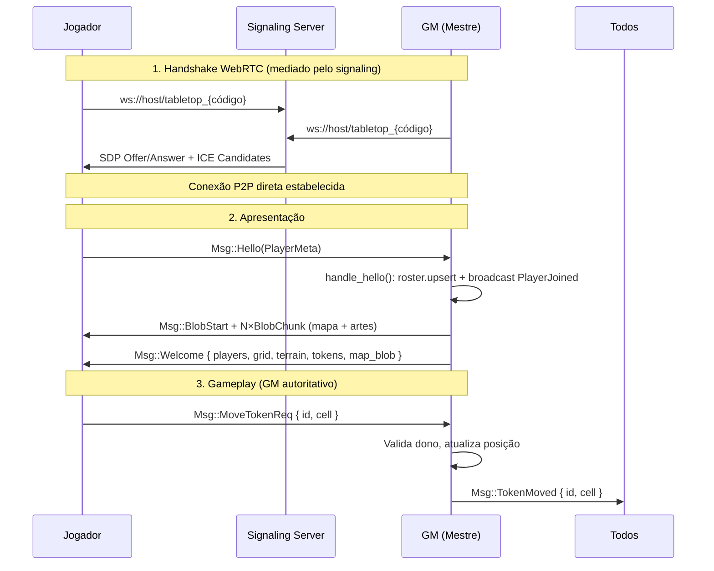

# Especificação Técnica Mestre — Projeto MVCAP2P

**Status:** Fonte Única da Verdade (SSOT)
**Escopo:** VTT tático 3D low-poly peer-to-peer em Rust/Bevy.

> Este documento constitui a **Fonte Única da Verdade (SSOT)**. Nenhuma implementação
> será aceita no repositório se divergir das definições aqui estabelecidas. A
> organização do **GitHub Projects** deve refletir exatamente os marcos e critérios
> de aceite deste plano.
>
> **Nota:** Esta SSOT foi revisada em 2026-07-21 conforme ADR-011 (simplificação
> do roadmap). O stack SpacetimeDB/GGRS/Rapier previsto anteriormente foi removido.

---

## 1. Visão Geral e Diretrizes Estratégicas

O projeto MVCAP2P é um VTT (Virtual Tabletop) tático **3D low-poly peer-to-peer**
em Rust/Bevy. Não há servidor de jogo: o **Mestre (GM) é o host autoritativo**.
Toda a comunicação entre peers é via WebRTC DataChannel (confiável/ordenado),
mediado por um servidor de sinalização WebSocket (matchbox).

### Pilares de Design

| Pilar | Prioridade Técnica | Contraste | Rationale |
| --- | --- | --- | --- |
| Sincronização | GM Autoritativo | Consenso Distribuído | GM valida e broadcast de toda mutação; sem rollback, sem conflito. |
| Identidade | Token Persistente Local | Login (e-mail/senha) | Identidade de 256-bit gerada localmente, persistida em arquivo. Zero dependência de servidor. |
| Performance | Otimização para ARM | Compatibilidade Universal | O "piso" de hardware é o Raspberry Pi 3; o software deve rodar a 30 FPS estáveis neste alvo. |
| Arquitetura | P2P puro (sem servidor de jogo) | Cliente-Servidor | Cada peer conecta-se diretamente aos outros via WebRTC. O signaling troca só handshakes. |

---

## 2. Stack Tecnológico e Infraestrutura de Linguagem

A padronização de ambiente é mandatória. Divergências de versão resultam em rejeição
automática no CI/CD.

- **Linguagem:** Rust 1.97.1 (Estável).
- **Engine:** Bevy 0.18 + `bevy_matchbox` 0.14 (WebRTC).
- **Gestão de Workspace:** Rust Workspaces com `shared/` (domínio sem Bevy) e
  `app/` (cliente Bevy).
- **Serialização:** `bincode` + `serde` para mensagens da rede (`Msg` enum).
- **Imagens:** `image` crate (decodificação PNG/JPEG/WebP) + `resvg` (SVG→textura).
- **Otimização de Compilação (sccache):** O uso de `sccache` é obrigatório para todos
  os desenvolvedores e agentes de CI.
  - **Configuração Local:** adicionar o wrapper ao `.cargo/config.toml`.
  - **Variáveis de Ambiente:** configurar `SCCACHE_BASEDIRS` para normalizar caminhos
    absolutos e garantir cache hits entre diferentes diretórios de build. Utilizar
    `SCCACHE_IGNORE_SERVER_IO_ERROR=1` para evitar falhas de compilação por
    instabilidade do wrapper.

---

## 3. Arquitetura de Rede P2P e Sincronização

O modelo é **GM autoritativo** sobre WebRTC DataChannel (canal 0, confiável/ordenado).
Não há rollback, nem GGRS, nem servidor de jogo — o GM é a autoridade final.

### Componentes de Rede

| Camada | Tecnologia | Função |
|--------|-----------|--------|
| **Signaling** | `matchbox_signaling` (WebSocket) | Media handshake WebRTC entre peers. Nenhum dado de jogo passa por ele. |
| **Transporte** | WebRTC DataChannel (confiável) | Canal 0, bincode serializado. Conexão direta P2P após handshake. |
| **Identidade** | Token local de 256-bit | Persistido em `~/.local/share/tabletop/identity.json`. Substitui `rand::random()` por sessão. |
| **Autoridade** | GM (Mestre) | Toda mutação de estado passa pelo GM: clientes enviam `*Req`, GM valida e faz broadcast da versão final. |

### Fluxo de Conexão e Sincronização

### Tratamento de Queda e Reconexão

- Signaling cai → retry com backoff (até 5 tentativas, 1.5s entre cada).
- GM cai → jogadores detectam `PeerState::Disconnected`; aguardam reconexão.
- GM volta → re-Hello do jogador → GM reenvia Welcome completo (resync total).
- Reconexão usa o mesmo código de sala; o estado inteiro cabe num Welcome.
- Identidade do jogador (`Identity` persistente) não muda entre reconexões,
  diferentemente do `PeerId` do WebRTC que é efêmero.

---

## 4. Grid, Terreno e Posicionamento

O tabuleiro é baseado em grade, sem motor de física 3D (Rapier foi removido conforme ADR-011).
O posicionamento usa snap-to-grid sobre coordenadas inteiras.

### Grid

- **Quadrangular** e **Hexagonal flat-top** (coordenadas axiais), alternável pelo GM.
- Tamanho de célula ajustável. Snap-to-grid em ambos os formatos.
- A posição de tokens e terreno é sempre `Cell = (i32, i32)`.

### Terreno

- Pintura de texturas por célula (grama, pedra, água, areia) + borracha.
- Elevação por célula (−4..+4), renderizada como altura do prisma low-poly.
- Tudo sincronizado via GM e incluído no Welcome.

### Tokens

- Tokens são peças 3D (puck + disco de arte + anel da cor do dono).
- Arrastar com preview a 20 Hz; snap final para centro da célula.
- GM move qualquer token; jogador só os seus (validado no GM, não só na UI).
- Remoção via Delete (dono ou GM).

---

## 5. Interface do Usuário

A UI usa o sistema nativo do Bevy (Node/Button/Text/ImageNode), sem bibliotecas
de immediate mode (egui removido conforme ADR-011).

- **Lobby:** entrada de apelido, escolha de cor (8 cores da paleta), criar sala
  (GM) ou entrar com código. Lista de salas abertas via Supabase REST (opcional).
- **HUD:** toolbar por papel (GM/jogador), roster de jogadores online, status,
  dicas, botão "Voltar ao Lobby".
- **Painel Gráficos:** toggles de MSAA, sombras, HDR, vegetação, grade, economia
  (30fps) — ajustáveis em runtime.
- **Responsivo:** escala automática baseada na largura da janela, com piso para
  alvos de toque confortáveis no mobile.

---

## 6. Visual e Assets

Estética visual guiada pelo minimalismo industrial ("Fallout 1 Tutorial").

- **Visual:** paleta industrial de alto contraste; materiais PBR, cena 3D com câmera
  orbital, luz direcional com sombras, árvores low-poly procedurais.
- **Arte dos tokens:** SVGs gerados no repositório (`assets/svg/`), rasterizados em
  runtime com `resvg`. Tokens embutidos: guerreiro, mago, ladino, dragão + importação
  de imagem por drag-and-drop (enviada em chunks de 14 KB via WebRTC).
- **Assets:** SVGs e fontes embutidos no binário via `include_bytes!`. Mapa importado
  como PNG/JPEG/WebP, fatiado e replicado aos peers.

---

## 7. Protocolo de QA e Testes de Integração

**Gate de Commit:** CI roda `cargo fmt --check` + `cargo clippy -D warnings` +
`cargo test` + `cargo doc --no-deps` em todo push/PR.

- **Testes automatizados (atuais):** testes unitários no crate `shared` (serialização,
  validação de tipos) e `app::grid` (matemática de grid).
- **Testes de estresse (futuro, Issue #9):** `--bench-mode` com bots simulando
  jogadores, logging de FPS e RAM.
- **QA em hardware real (Issue #5):** Raspberry Pi 3 como ambiente de teste headless.
- **Métricas de Readiness (KPIs):**
  - **FPS:** > 30 FPS estáveis em cena de estresse (10 jogadores).
  - **Memória:** consumo de RAM < 512MB (contagem total da aplicação).
  - **Rede:** latência de processamento de mensagem < 50ms.

---

## 8. Roadmap de Épicos (GitHub Projects)

Cada card no GitHub Projects deve seguir rigorosamente os critérios abaixo.
> **Nota:** Este roadmap foi revisado em 2026-07-21 conforme ADR-011. Os épicos
> originais #2 (SpacetimeDB), #3 (Rapier) e #4 (UI Framework com egui) foram
> substituídos pelos itens abaixo.

### P0 ✅ — Fundação (concluído)
- **Issue #1 — [Infra] Configuração de Workspace e Cache**
  - Workspace com `app/`, `shared/`, `signaling/`, `docgen/`.
  - `sccache` habilitado globalmente.
  - Upgrade Bevy 0.16 → 0.18.

### P1 — Identidade Persistente Local
- **Issue #2 (refatorada) — [Rede] Core de Identidade Local P2P**
  - **Ação:** implementar token de 256-bit persistido em arquivo
    (`~/.local/share/tabletop/identity.json`). Substituir `rand::random()` na criação
    de sessão por uma identidade estável entre reinícios.
  - **Critério de Aceite:**
    - Cliente gera token único na primeira execução e persiste em disco.
    - Cliente reconhece o mesmo `username` (apelido escolhido) após reinício.
    - Ao reabrir o jogo, o lobby pré-preenche o nick e a cor da sessão anterior.
  - **Stack:** `shared` (newtype `Identity`), `app` (leitura/escrita de arquivo).

### P2 — Infra de Testes Automatizados
- **Issue #9 (refatorada) — [QA] Sala de Testes Automatizada (`--bench-mode`)**
  - **Ação:** criar sistema de bots internos que simulam jogadores, acionável via
    `--bench-mode`. Logging de FPS médio e pico de RAM após N quadros.
  - **Critério de Aceite:**
    - `cargo run -- --bench-mode` carrega cena de estresse com bots, sem lobby.
    - Logging de KPIs (FPS, RAM) no console após 1.000 quadros simulados.
    - Estabilidade: roda 10 minutos sem pânico.

### P3 — UI 2.0 Mobile-First
- **Issue #4 (refatorada) — [UI] Interface Mobile-First**
  - **Ação:** UI responsiva com Bevy UI nativa (sem egui). Joystick virtual para
    Android. Menu flutuante modular com áreas de toque ergonômicas.
  - **Critério de Aceite:**
    - UI adaptável a diferentes resoluções (mobile + desktop).
    - Joystick virtual funcional em Android.
    - Painel "Gráficos" existente mantido e integrável.

### P4 — QA + Estabilização
- **Issue #5 — [QA] Configuração de Ambiente (Raspberry Pi 3)**
  - Ambiente headless no RPi3 para teste de performance.
- **Issue #6 — 🧪 Rodada de Testes v0.1.0-alpha**
  - Teste manual com 4+ jogadores, validação de sincronia e FPS.
- **Estabilização geral:**
  - Auditoria de ordenação de sistemas.
  - Docstrings em todo o código público.
  - CI maduro.
