# Crate: `tabletop`

```mermaid
graph TD
  tabletop["tabletop"]
  game_sync["sync"]
  tabletop --> game_sync
  lib["lib"]
  tabletop --> lib
  game_lowpoly["lowpoly"]
  tabletop --> game_lowpoly
  game_mod["mod"]
  tabletop --> game_mod
  protocol["protocol"]
  tabletop --> protocol
  game_tokens["tokens"]
  tabletop --> game_tokens
  game_hud["hud"]
  tabletop --> game_hud
  game_camera["camera"]
  tabletop --> game_camera
  svg_assets["svg_assets"]
  tabletop --> svg_assets
  game_map["map"]
  tabletop --> game_map
  lobby["lobby"]
  tabletop --> lobby
  main["main"]
  tabletop --> main
  room_discovery["room_discovery"]
  tabletop --> room_discovery
  game_grid["grid"]
  tabletop --> game_grid
  game_graphics["graphics"]
  tabletop --> game_graphics
  net["net"]
  tabletop --> net
  game_terrain["terrain"]
  tabletop --> game_terrain
```

## Módulos

### [`sync`](modules/game__sync) — `src/game/sync.rs`

- **Systems**: handle_tokens

### [`lib`](modules/lib) — `src/lib.rs`

- **Resources**: CliArgs
- **Systems**: screenshot_hotkey, auto_shot_exit
- **Structs**: `CliArgs`
- **Enums**: `AppState`

### [`lowpoly`](modules/game__lowpoly) — `src/game/lowpoly.rs`

- **Resources**: LowPoly, Mats
- **Components**: Vegetation
- **Systems**: setup_lowpoly, spawn_tree
- **Structs**: `LowPoly`, `Mats`, `Ctx3d`, `Vegetation`

### [`mod`](modules/game__mod) — `src/game/mod.rs`

- **Resources**: ScreenInfo, UiHovered
- **Systems**: setup_lighting, leave_game, game_init
- **Structs**: `ScreenInfo`, `UiHovered`, `GamePlugin`
- **Enums**: `ActiveTool`

### [`protocol`](modules/protocol) — `src/protocol.rs`

 Ponte do cliente para o domínio compartilhado.
 Re-exporta todos os tipos do crate [`shared`] (Bevy-free) e adiciona os
 adaptadores específicos do cliente — a conversão de cor para `bevy::Color`.
 Assim o resto do código continua usando `crate::protocol::*` sem mudança.
 Ver ADR-009.

### [`tokens`](modules/game__tokens) — `src/game/tokens.rs`

- **Resources**: Selection, Dragging, TouchDrag
- **Components**: Token, PendingArt, OwnerRing, ArtDisc, SelRing
- **Systems**: spawn_token, delete_selected, resolve_pending_art
- **Structs**: `Token`, `PendingArt`, `OwnerRing`, `ArtDisc`, `SelRing`, `Selection`, `Dragging`, `TouchDrag`

### [`hud`](modules/game__hud) — `src/game/hud.rs`

- **Components**: HudRoot, RosterPanel, RosterRow, StatusLabel, HintLabel, BackBtn, ScaleUpBtn, ScaleDownBtn, AssignTokenBtn
- **Systems**: tool_button, spawn_hud, setup_hud, scale_btn_click, roster_panel
- **Structs**: `HudRoot`, `RosterPanel`, `RosterRow`, `StatusLabel`, `HintLabel`, `BackBtn`, `ScaleUpBtn`, `ScaleDownBtn`, `AssignTokenBtn`
- **Enums**: `ToolBtn`

### [`camera`](modules/game__camera) — `src/game/camera.rs`

- **Resources**: CamRig, TouchState
- **Components**: MainCamera
- **Systems**: setup_camera
- **Structs**: `MainCamera`, `CamRig`, `TouchState`

### [`svg_assets`](modules/svg_assets) — `src/svg_assets.rs`

- **Resources**: GameAssets
- **Systems**: load_svgs
- **Structs**: `SvgAssetsPlugin`, `GameAssets`

### [`map`](modules/game__map) — `src/game/map.rs`

- **Resources**: MapState
- **Components**: MapGround
- **Systems**: sync_map, file_drop
- **Structs**: `MapState`, `MapGround`
- **Enums**: `DropMode`

### [`lobby`](modules/lobby) — `src/lobby.rs`

- **Resources**: RoomList, LobbyForm
- **Components**: LobbyRoot, NickField, CodeField, NickText, CodeText, StatusText, Swatch, CreateBtn, JoinBtn, RoomsPanel, RoomsContainer, RoomEntryBtn, RoomEmptyLabel
- **Systems**: setup_lobby, cleanup_lobby, start_session, lobby_auto, lobby_clicks, room_poll
- **Structs**: `RoomList`, `LobbyPlugin`, `LobbyForm`, `LobbyRoot`, `NickField`, `CodeField`, `NickText`, `CodeText`, `StatusText`, `Swatch`, `CreateBtn`, `JoinBtn`, `RoomsPanel`, `RoomsContainer`, `RoomEntryBtn`, `RoomEmptyLabel`
- **Enums**: `Focus`

### [`main`](modules/main) — `src/main.rs`

### [`room_discovery`](modules/room_discovery) — `src/room_discovery.rs`

- **Structs**: `RoomEntry`

### [`grid`](modules/game__grid) — `src/game/grid.rs`

- **Resources**: GridRes
- **Systems**: draw_grid
- **Structs**: `GridRes`

### [`graphics`](modules/game__graphics) — `src/game/graphics.rs`

 Opções gráficas ajustáveis em runtime — foco em desempenho em dispositivos
 fracos (Android). Cada campo liga/desliga um custo relevante de GPU/CPU e é
 controlável pelo painel "Gráficos" do HUD. Defaults começam baixos no Android.

- **Resources**: GraphicsSettings
- **Components**: GfxUiRoot, GfxPanel, GfxOpenBtn, GfxToggleBtn
- **Systems**: apply_graphics, toggle_btn, spawn_gfx_ui, despawn_gfx_ui
- **Structs**: `GraphicsSettings`, `GfxUiRoot`, `GfxPanel`, `GfxOpenBtn`, `GfxToggleBtn`
- **Enums**: `MsaaLevel`, `GfxOption`

### [`net`](modules/net) — `src/net.rs`

- **Resources**: Session, Net, Roster, Blobs
- **Structs**: `NetPlugin`, `NetSet`, `NetRx`, `PeerEvent`, `Session`, `Net`, `RosterEntry`, `Roster`, `Incoming`, `Blobs`

### [`terrain`](modules/game__terrain) — `src/game/terrain.rs`

- **Resources**: Terrain, TerrainRender
- **Systems**: terrain_render
- **Structs**: `Terrain`, `TerrainRender`
- **Enums**: `Op`

