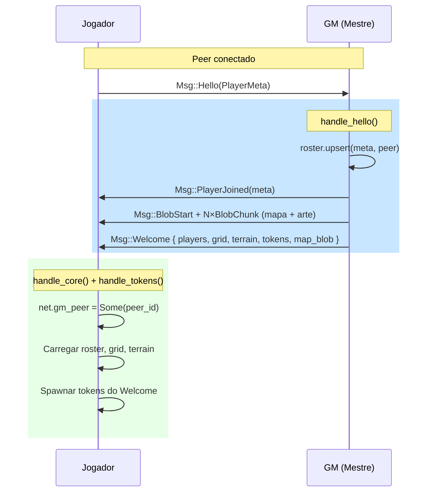

# `sync`

**Path**: `src/game/sync.rs`

## Funções

### `handle_hello`

```rust
fn handle_hello(mut rx : MessageReader < NetRx >, session : Option < Res < Session > >, mut net : ResMut < Net >, mut roster : ResMut < Roster >, grid : Res < GridRes >, terrain : Res < Terrain >, map_state : Res < MapState >, blobs : Res < Blobs >, q_tokens : Query < & Token >) -> ()
```

 GM: responde Hello com o estado completo (blobs primeiro — canal ordenado garante a chegada antes do Welcome).

### `handle_core`

```rust
fn handle_core(mut rx : MessageReader < NetRx >, session : Option < Res < Session > >, mut net : ResMut < Net >, mut roster : ResMut < Roster >, mut grid : ResMut < GridRes >, mut terrain : ResMut < Terrain >, mut trender : ResMut < TerrainRender >, mut map_state : ResMut < MapState >) -> ()
```

 Estado global: roster, grid, mapa, terreno.

### `assign_token_rx`

```rust
fn assign_token_rx(mut rx : MessageReader < NetRx >, session : Option < Res < Session > >, roster : Res < Roster >, mut ctx : Ctx3d, mut q_tokens : Query < (Entity , & mut Token , & Children) >, mut q_rings : Query < & mut MeshMaterial3d < StandardMaterial > , With < OwnerRing > >) -> ()
```

 Processa `AssignToken` em jogadores não-mestre: atualiza dono e cor do anel.

## Systems (Bevy)

### `handle_tokens`

 Tokens: spawn/move/remove/preview, com autoridade do GM sobre requests.

 Posições: XZ snap imediato; altura (Y) é resolvida pelo token_y_follow.

**Parâmetros**: `mut commands : Commands`, `mut rx : MessageReader < NetRx >`, `session : Option < Res < Session > >`, `mut net : ResMut < Net >`, `roster : Res < Roster >`, `grid : Res < GridRes >`, `blobs : Res < Blobs >`, `assets : Res < GameAssets >`, `mut q_tokens : Query < (Entity , & mut Transform , & mut Token) >`, `mut drag : ResMut < Dragging >`, `mut ctx : Ctx3d`


## Fluxo de Sincronização (Hello → Welcome)



