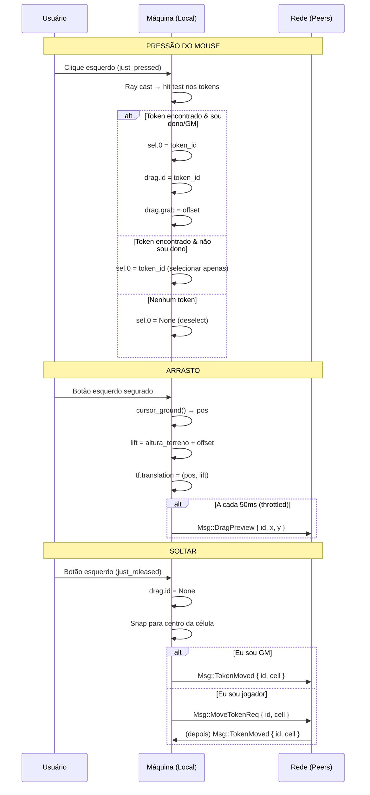

# `tokens`

**Path**: `src/game/tokens.rs`

## Resources (Bevy)

### `Selection`

### `Dragging`

| Campo | Tipo |
|-------|------|
| `id` | `Option < TokenId >` |
| `grab` | `Vec2` |
| `last_tx` | `f32` |

### `TouchDrag`

| Campo | Tipo |
|-------|------|
| `token_id` | `Option < TokenId >` |
| `finger_id` | `Option < u64 >` |
| `grab` | `Vec2` |
| `last_tx` | `f32` |

## Components (Bevy)

### `Token`

| Campo | Tipo |
|-------|------|
| `meta` | `TokenMeta` |

### `PendingArt`

### `OwnerRing`

### `ArtDisc`

### `SelRing`

## Funções

### `token_size`

```rust
fn token_size(g : & GridCfg) -> f32
```

### `token_interact`

```rust
fn token_interact(buttons : Res < ButtonInput < MouseButton > >, windows : Query < & Window >, q_cam : Query < (& Camera , & GlobalTransform) , With < MainCamera > >, mut q_tokens : Query < (Entity , & mut Transform , & mut Token) >, session : Res < Session >, tool : Res < ActiveTool >, ui : Res < UiHovered >, mut sel : ResMut < Selection >, mut drag : ResMut < Dragging >, mut net : ResMut < Net >, grid : Res < GridRes >, terrain : Res < Terrain >, time : Res < Time >) -> ()
```

### `token_y_follow`

```rust
fn token_y_follow(time : Res < Time >, terrain : Res < Terrain >, grid : Res < GridRes >, drag : Res < Dragging >, mut q : Query < (& mut Transform , & Token) >) -> ()
```

### `selection_visual`

```rust
fn selection_visual(sel : Res < Selection >, q_tokens : Query < (& Token , & Children) >, mut q_rings : Query < & mut Visibility , With < SelRing > >) -> ()
```

### `touch_interact`

```rust
fn touch_interact(mut touch_ev : EventReader < TouchInput >, windows : Query < & Window >, q_cam : Query < (& Camera , & GlobalTransform) , With < MainCamera > >, mut q_tokens : Query < (Entity , & mut Transform , & mut Token) >, session : Res < Session >, tool : Res < ActiveTool >, mut sel : ResMut < Selection >, mut drag : ResMut < TouchDrag >, mut net : ResMut < Net >, grid : Res < GridRes >, terrain : Res < Terrain >, time : Res < Time >) -> ()
```

### `touch_highlight`

```rust
fn touch_highlight(drag : Res < TouchDrag >, sel : Res < Selection >, time : Res < Time >, q_tokens : Query < (& Token , & Children) >, mut q_rings : Query < & mut Transform , With < SelRing > >) -> ()
```

### `set_token_owner`

```rust
fn set_token_owner(id : TokenId, new_owner : PlayerUuid, roster : & Roster, ctx : & mut Ctx3d, q_tokens : & mut Query < (Entity , & mut Token , & Children) >, mut q_rings : & mut Query < & mut MeshMaterial3d < StandardMaterial > , With < OwnerRing > >) -> ()
```

### `refresh_ring_colors`

```rust
fn refresh_ring_colors(roster : Res < Roster >, mut ctx : Ctx3d, q_tokens : Query < (& Token , & Children) >, mut q_rings : Query < & mut MeshMaterial3d < StandardMaterial > , With < OwnerRing > >) -> ()
```

## Systems (Bevy)

### `spawn_token`

**Parâmetros**: `commands : & mut Commands`, `meta : TokenMeta`, `assets : & GameAssets`, `blobs : & Blobs`, `g : & GridCfg`, `roster : & Roster`, `ctx : & mut Ctx3d`

### `delete_selected`

**Parâmetros**: `keys : Res < ButtonInput < KeyCode > >`, `mut sel : ResMut < Selection >`, `session : Res < Session >`, `mut net : ResMut < Net >`, `mut commands : Commands`, `q_tokens : Query < (Entity , & Token) >`

### `resolve_pending_art`

**Parâmetros**: `mut commands : Commands`, `blobs : Res < Blobs >`, `assets : Res < GameAssets >`, `mut ctx : Ctx3d`, `q_pending : Query < (Entity , & PendingArt , & Children) >`, `mut q_art : Query < & mut MeshMaterial3d < StandardMaterial > , With < ArtDisc > >`


## Fluxo de Arrasto de Token



