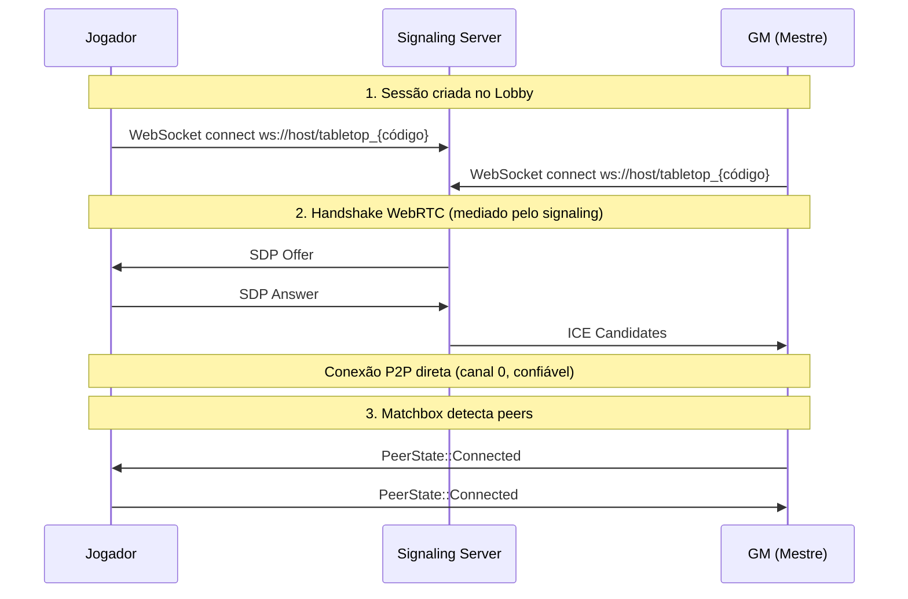

# `net`

**Path**: `src/net.rs`

## Resources (Bevy)

### `Session`

| Campo | Tipo |
|-------|------|
| `me` | `PlayerMeta` |
| `code` | `String` |

### `Net`

| Campo | Tipo |
|-------|------|
| `socket` | `Option < MatchboxSocket >` |
| `gm_peer` | `Option < PeerId >` |
| `room_url` | `Option < String >` |
| `reconnect` | `Option < Timer >` |
| `retries` | `u32` |

### `Roster`

| Campo | Tipo |
|-------|------|
| `list` | `Vec < RosterEntry >` |

### `Blobs`

| Campo | Tipo |
|-------|------|
| `data` | `HashMap < BlobId , Vec < u8 > >` |
| `images` | `HashMap < BlobId , Handle < Image > >` |
| `incoming` | `HashMap < BlobId , Incoming >` |

## Events (Bevy)

### `NetRx`

### `PeerEvent`

| Campo | Tipo |
|-------|------|
| `peer` | `PeerId` |
| `connected` | `bool` |

## Structs

### `NetPlugin`

**Derives**: 

### `NetSet`

**Derives**: SystemSet, Debug, Clone, PartialEq, Eq, Hash

### `RosterEntry`

**Derives**: Clone

| Campo | Tipo |
|-------|------|
| `meta` | `PlayerMeta` |
| `peer` | `Option < PeerId >` |
| `online` | `bool` |

### `Incoming`

**Derives**: 

| Campo | Tipo |
|-------|------|
| `chunks` | `u32` |
| `parts` | `Vec < Option < Vec < u8 > > >` |

## Funções

### `net_poll`

```rust
fn net_poll(mut net : ResMut < Net >, mut rx : EventWriter < NetRx >, mut pev : EventWriter < PeerEvent >) -> ()
```

### `peer_greetings`

```rust
fn peer_greetings(mut ev : EventReader < PeerEvent >, mut net : ResMut < Net >, session : Option < Res < Session > >, mut roster : ResMut < Roster >) -> ()
```

### `blob_rx`

```rust
fn blob_rx(mut rx : EventReader < NetRx >, mut blobs : ResMut < Blobs >, mut images : ResMut < Assets < Image > >) -> ()
```

### `net_reconnect`

```rust
fn net_reconnect(mut net : ResMut < Net >, time : Res < Time >) -> ()
```

## Implementações

### `impl Plugin for impl Plugin for NetPlugin { fn build (& self , app : & mut App) { app . add_event :: < NetRx > () . add_event :: < PeerEvent > () . init_resource :: < Net > () . init_resource :: < Roster > () . init_resource :: < Blobs > () . add_systems (Update , (net_reconnect , net_poll , peer_greetings , blob_rx) . chain () . in_set (NetSet) ,) ; } } . self_ty`

- `build`

### `impl impl Net { pub fn connect (& mut self , url : & str) { info ! ("conectando à sinalização: {url}") ; self . room_url = Some (url . to_string ()) ; self . socket = Some (MatchboxSocket :: new_reliable (url)) ; } pub fn send_to (& mut self , peer : PeerId , msg : & Msg) { if let Some (s) = self . socket . as_mut () { let data = bincode :: serialize (msg) . expect ("serialize") . into_boxed_slice () ; s . channel_mut (0) . send (data , peer) ; } } pub fn peers (& self) -> Vec < PeerId > { self . socket . as_ref () . map (| s | s . connected_peers () . collect ()) . unwrap_or_default () } pub fn broadcast (& mut self , msg : & Msg) { for p in self . peers () { self . send_to (p , msg) ; } } pub fn send_gm (& mut self , msg : & Msg) { if let Some (p) = self . gm_peer { self . send_to (p , msg) ; } } pub fn disconnect (& mut self) { self . socket = None ; self . gm_peer = None ; self . room_url = None ; self . reconnect = None ; self . retries = 0 ; } # [doc = " Envia um blob em chunks; `peer = None` faz broadcast."] pub fn send_blob_to (& mut self , peer : Option < PeerId > , id : BlobId , data : & [u8]) { let chunks = data . chunks (CHUNK) . count () as u32 ; let start = Msg :: BlobStart { id , kind : BlobKind :: Image , len : data . len () as u32 , chunks } ; match peer { Some (p) => self . send_to (p , & start) , None => self . broadcast (& start) , } for (i , c) in data . chunks (CHUNK) . enumerate () { let m = Msg :: BlobChunk { id , seq : i as u32 , data : c . to_vec () } ; match peer { Some (p) => self . send_to (p , & m) , None => self . broadcast (& m) , } } } } . self_ty`

- `connect`
- `send_to`
- `peers`
- `broadcast`
- `send_gm`
- `disconnect`
- `send_blob_to`

### `impl impl Roster { pub fn upsert (& mut self , meta : PlayerMeta , peer : Option < PeerId >) { if let Some (e) = self . list . iter_mut () . find (| e | e . meta . uuid == meta . uuid) { e . meta = meta ; if peer . is_some () { e . peer = peer ; } e . online = true ; } else { self . list . push (RosterEntry { meta , peer , online : true }) ; } } pub fn by_peer (& self , p : PeerId) -> Option < & RosterEntry > { self . list . iter () . find (| e | e . peer == Some (p)) } pub fn set_peer (& mut self , uuid : PlayerUuid , peer : Option < PeerId >) { if let Some (e) = self . list . iter_mut () . find (| e | e . meta . uuid == uuid) { e . peer = peer ; } } pub fn set_online (& mut self , uuid : PlayerUuid , online : bool) { if let Some (e) = self . list . iter_mut () . find (| e | e . meta . uuid == uuid) { e . online = online ; } } pub fn set_offline_by_peer (& mut self , p : PeerId) -> Option < PlayerUuid > { if let Some (e) = self . list . iter_mut () . find (| e | e . peer == Some (p)) { e . online = false ; return Some (e . meta . uuid) ; } None } } . self_ty`

- `upsert`
- `by_peer`
- `set_peer`
- `set_online`
- `set_offline_by_peer`

### `impl impl Blobs { pub fn store (& mut self , id : BlobId , bytes : Vec < u8 > , images : & mut Assets < Image >) -> Option < Handle < Image > > { let img = crate :: svg_assets :: image_from_encoded (& bytes) ? ; let h = images . add (img) ; self . images . insert (id , h . clone ()) ; self . data . insert (id , bytes) ; Some (h) } } . self_ty`

- `store`

## Constantes

| Nome | Tipo | Valor |
|------|------|-------|
| `MAX_RETRIES` | `const MAX_RETRIES : u32 = 5 ; . ty` | `const MAX_RETRIES : u32 = 5 ; . expr` |


## Fluxo de Conexão WebRTC



