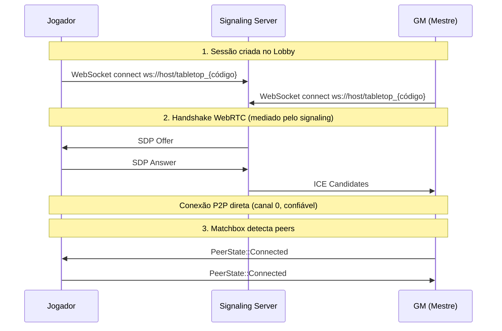

# `net`

**Path**: `src/net.rs`

## Resources (Bevy)

### `Session`

| Campo | Tipo |
|-------|------|
| `me` | `PlayerMeta` |
| `code` | `RoomCode` |

### `Net`

| Campo | Tipo |
|-------|------|
| `socket` | `Option < MatchboxSocket >` |
| `gm_peer` | `Option < PeerId >` |
| `room_url` | `Option < String >` |
| `reconnect` | `Option < Timer >` |
| `retries` | `u32` |

### `Roster`

| Campo | Tipo |
|-------|------|
| `list` | `Vec < RosterEntry >` |

### `Blobs`

| Campo | Tipo |
|-------|------|
| `data` | `HashMap < BlobId , Vec < u8 > >` |
| `images` | `HashMap < BlobId , Handle < Image > >` |
| `incoming` | `HashMap < BlobId , Incoming >` |

## Structs

### `NetPlugin`

**Derives**: 

### `NetSet`

**Derives**: SystemSet, Debug, Clone, PartialEq, Eq, Hash

### `NetRx`

**Derives**: Message

### `PeerEvent`

**Derives**: Message

| Campo | Tipo |
|-------|------|
| `peer` | `PeerId` |
| `connected` | `bool` |

### `RosterEntry`

**Derives**: Clone

| Campo | Tipo |
|-------|------|
| `meta` | `PlayerMeta` |
| `peer` | `Option < PeerId >` |
| `online` | `bool` |

### `Incoming`

**Derives**: 

| Campo | Tipo |
|-------|------|
| `chunks` | `u32` |
| `parts` | `Vec < Option < Vec < u8 > > >` |

## Funções

### `net_poll`

```rust
fn net_poll(mut net : ResMut < Net >, mut rx : MessageWriter < NetRx >, mut pev : MessageWriter < PeerEvent >) -> ()
```

### `peer_greetings`

```rust
fn peer_greetings(mut ev : MessageReader < PeerEvent >, mut net : ResMut < Net >, session : Option < Res < Session > >, mut roster : ResMut < Roster >) -> ()
```

### `blob_rx`

```rust
fn blob_rx(mut rx : MessageReader < NetRx >, mut blobs : ResMut < Blobs >, mut images : ResMut < Assets < Image > >) -> ()
```

### `net_reconnect`

```rust
fn net_reconnect(mut net : ResMut < Net >, time : Res < Time >) -> ()
```

## Implementações

### `impl Plugin for NetPlugin`

- `build`

### `impl Net`

- `connect`
- `send_to`
- `peers`
- `broadcast`
- `send_gm`
- `disconnect`
- `send_blob_to`

### `impl Roster`

- `upsert`
- `by_peer`
- `set_peer`
- `set_online`
- `set_offline_by_peer`

### `impl Blobs`

- `store`

## Constantes

| Nome | Tipo | Valor |
|------|------|-------|
| `MAX_RETRIES` | `u32` | `5` |


## Fluxo de Conexão WebRTC



