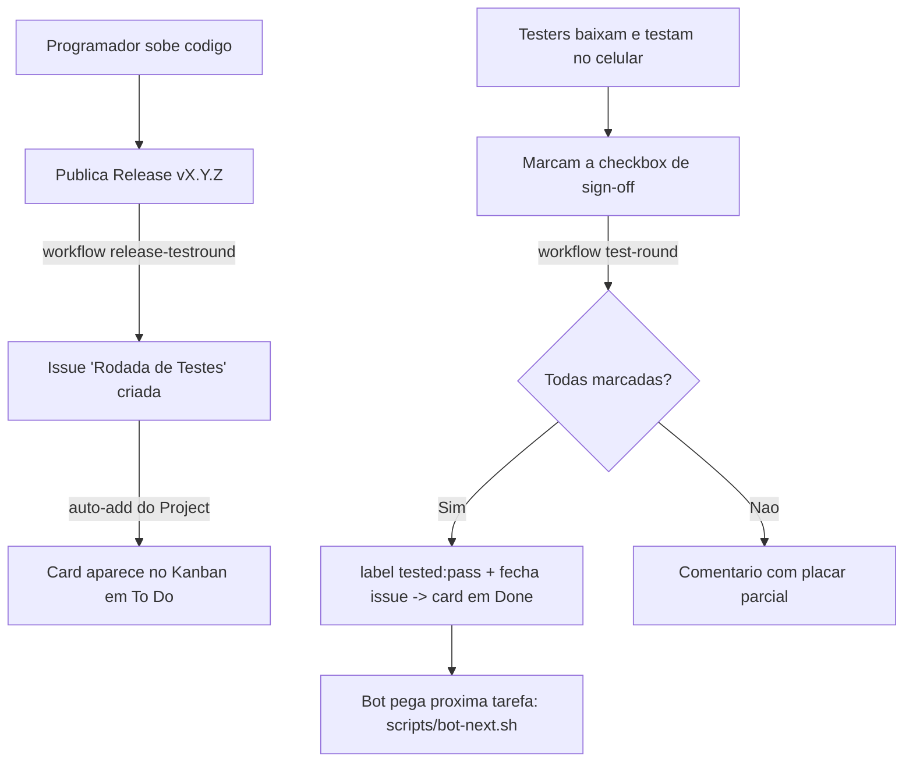
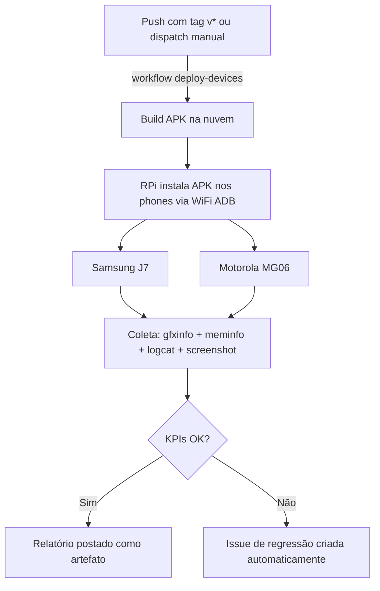

# Loop de Testes Automatizado (Kanban + Testers)

Como uma versão nova vira uma rodada de testes distribuída e volta como "aprovado"
no board, com o mínimo de trabalho manual.

## Papéis

- **Programador / bot** — implementa tarefas, sobe código, publica Releases.
- **Testers** — baixam a versão, testam no aparelho e marcam uma checkbox.
- **Raspberry Pi (Android Farm)** — runner self-hosted que roda testes automatizados em dispositivos físicos.
- **Automação (GitHub Actions)** — cria a rodada, executa deploy nos devices, cria issues de regressão, contabiliza os sign-offs e move o card.

## Fluxo Manual (Rodada de Testes)

## Fluxo Automatizado (Android Farm — RPi)

### Infraestrutura

| Componente | Detalhe |
|---|---|
| **Runner** | Raspberry Pi 3 — self-hosted, labels `android-farm,rpi` |
| **Devices** | Samsung J7 (WiFi ADB via `J7_IP`) + Motorola MG06 (WiFi ADB via `MG06_IP`) |
| **Scripts** | `setup-pi.sh` (provisão do runner), `deploy-farm.sh` (deploy + coleta), `android-driver.sh` (retry autônomo) |

### KPIs (Gate de Performance)

| Métrica | Limite | Dispositivo |
|---|---|---|
| FPS | ≥ 30 estáveis | Samsung J7 (stress test com mapas, tokens, animações, efeitos) |
| RAM | ≤ 1024 MB | Samsung J7 (consumo total do app) — relaxado de 600 até P4 |
| Latência | < 50 ms | Ambos devices |

## Peças no repositório

| Arquivo | Função |
| --- | --- |
| `.github/workflows/deploy-devices.yml` | Build APK + deploy nos devices + coleta de métricas no RPi. |
| `.github/workflows/release-testround.yml` | Ao publicar Release → cria a issue de rodada de testes. |
| `.github/workflows/test-round.yml` | Ao editar a issue → conta as caixas; tudo marcado → fecha (card p/ Done). |
| `.github/ISSUE_TEMPLATE/test_round.md` | Template manual de rodada de testes. |
| `scripts/deploy-farm.sh` | Instala APK em todos os devices ADB, coleta gfxinfo/meminfo/logcat/screenshot. |
| `scripts/setup-pi.sh` | Provisiona RPi como self-hosted runner com label `android-farm,rpi`. |
| `scripts/android-driver.sh` | Loop autônomo de build+deploy com retry e checkpoint JSON. |
| `scripts/bot-next.sh` | Painel: mostra ao bot/dev a próxima tarefa. |
| `scripts/seed-github-issues.sh` | Recria o backlog de épicos como Issues. |

## Configuração única (feita uma vez no GitHub)

1. **Project → Workflows** (⚙): ative **"Auto-add to project"** com filtro `is:issue`
   para que toda issue nova entre no Kanban sozinha.
2. **Project → Workflows**: ative **"Item closed → Status: Done"** para o card andar
   ao fechar a rodada aprovada.
3. **Testers**: adicione o grupo como **collaborators** (permissão *Write*) em
   *Settings → Collaborators* — é o que permite marcar as checkboxes. (Board pode ser
   deixado **público** só-leitura para quem quiser acompanhar.)
4. **Variables do repositório**: definir `J7_IP` e `MG06_IP` em *Settings → Variables*
   com os IPs WiFi dos dispositivos para conexão ADB.

## Como o tester participa

1. Recebe notificação da Release (basta dar *Watch → Releases* no repo).
2. Baixa o binário/APK da Release.
3. Testa a sala de teste (ex.: 4 players em `TESTE`).
4. Abre a issue "🧪 Rodada de Testes" e **marca sua caixa**, preenchendo FPS/aparelho.

Quando o último tester marca, a automação fecha a rodada e o board mostra **Done**.
