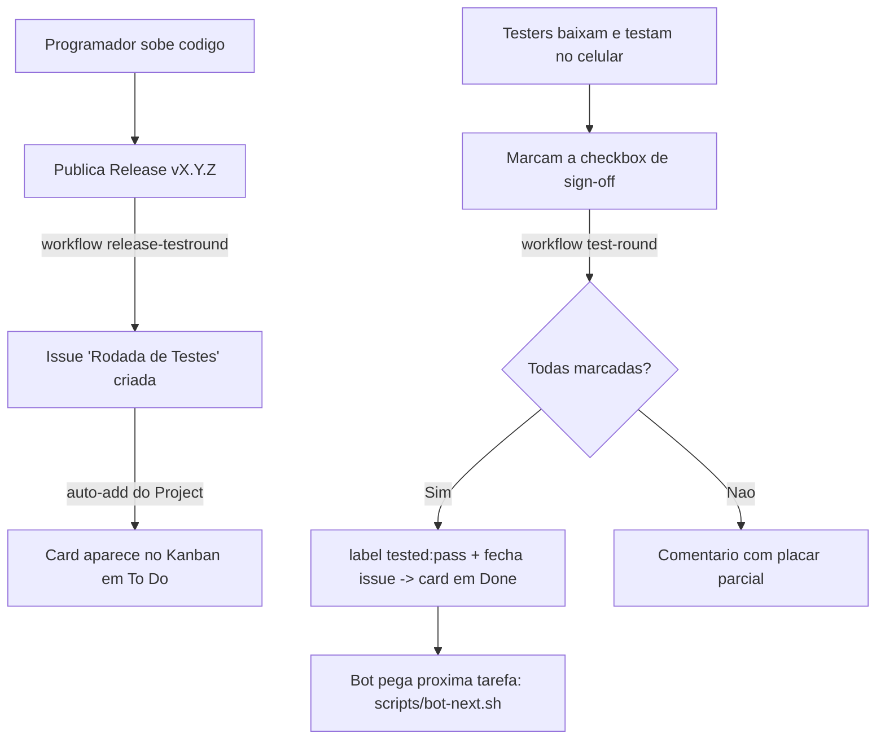

# Loop de Testes Automatizado (Kanban + Testers)

Como uma versão nova vira uma rodada de testes distribuída e volta como "aprovado"
no board, com o mínimo de trabalho manual.

## Papéis

- **Programador / bot** — implementa tarefas, sobe código, publica Releases.
- **Testers** — baixam a versão, testam no aparelho e marcam uma checkbox.
- **Automação (GitHub Actions)** — cria a rodada, contabiliza os sign-offs e move o card.

## Fluxo

## Peças no repositório

| Arquivo | Função |
| --- | --- |
| `.github/workflows/release-testround.yml` | Ao publicar Release → cria a issue de rodada de testes. |
| `.github/workflows/test-round.yml` | Ao editar a issue → conta as caixas; tudo marcado → fecha (card p/ Done). |
| `.github/ISSUE_TEMPLATE/test_round.md` | Template manual de rodada de testes. |
| `scripts/bot-next.sh` | Painel: mostra ao bot/dev a próxima tarefa. |
| `scripts/seed-github-issues.sh` | Recria o backlog de épicos como Issues. |

## Configuração única (feita uma vez no GitHub)

1. **Project → Workflows** (⚙): ative **"Auto-add to project"** com filtro `is:issue`
   para que toda issue nova entre no Kanban sozinha.
2. **Project → Workflows**: ative **"Item closed → Status: Done"** para o card andar
   ao fechar a rodada aprovada.
3. **Testers**: adicione o grupo como **collaborators** (permissão *Write*) em
   *Settings → Collaborators* — é o que permite marcar as checkboxes. (Board pode ser
   deixado **público** só-leitura para quem quiser acompanhar.)

## Como o tester participa

1. Recebe notificação da Release (basta dar *Watch → Releases* no repo).
2. Baixa o binário/APK da Release.
3. Testa a sala de teste (ex.: 4 players em `TESTE`).
4. Abre a issue "🧪 Rodada de Testes" e **marca sua caixa**, preenchendo FPS/aparelho.

Quando o último tester marca, a automação fecha a rodada e o board mostra **Done**.
